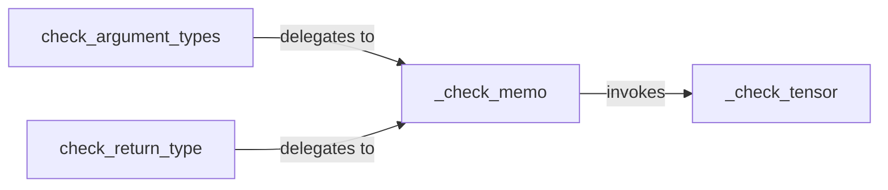

## Details

The Runtime Type Validation (RTV) subsystem, encapsulated within the torchtyping.typechecker module, orchestrates and executes runtime type checks for tensors based on TensorType annotations. It integrates with external type-checking libraries and incorporates performance optimizations. It provides public entry points for validating function arguments and return values, leveraging memoization for efficiency, and a core logic component for detailed tensor validation.

### check_argument_types
Serves as the primary public API entry point for initiating runtime validation of function arguments. It orchestrates the initial phase of type checking for input parameters, delegating the actual validation work to internal components. This component is crucial for applying TensorType checks to function inputs.

**Related Classes/Methods**:

- <a href="https://github.com/patrick-kidger/torchtyping/blob/master/torchtyping/typechecker.py#L329-L343" target="_blank" rel="noopener noreferrer">`torchtyping.typechecker.check_argument_types`:329-343</a>

### check_return_type
Serves as the primary public API entry point for initiating runtime validation of a function's return value. Similar to check_argument_types, it orchestrates the initial phase of type checking for the output, ensuring that the function's return conforms to its TensorType annotation.

**Related Classes/Methods**:

- <a href="https://github.com/patrick-kidger/torchtyping/blob/master/torchtyping/typechecker.py#L345-L360" target="_blank" rel="noopener noreferrer">`torchtyping.typechecker.check_return_type`:345-360</a>

### _check_memo
Manages a memoization cache to optimize performance by storing and retrieving results of previous type checks. It acts as an intermediary, preventing redundant validation calls to _check_tensor for already processed types or tensors. This component directly implements the "performance optimizations like memoization" aspect of RTV.

**Related Classes/Methods**:

- <a href="https://github.com/patrick-kidger/torchtyping/blob/master/torchtyping/typechecker.py#L90-L257" target="_blank" rel="noopener noreferrer">`torchtyping.typechecker._check_memo`:90-257</a>

### _check_tensor
Contains the core logic for performing the detailed runtime validation of a tensor against its TensorType annotation. This includes comparing properties like shape, data type, and potentially other constraints. This is where the integration with external type-checking libraries (like typeguard) would primarily occur to perform the actual validation. It is the heart of the RTV's validation capability.

**Related Classes/Methods**:

- <a href="https://github.com/patrick-kidger/torchtyping/blob/master/torchtyping/typechecker.py#L62-L87" target="_blank" rel="noopener noreferrer">`torchtyping.typechecker._check_tensor`:62-87</a>

### [FAQ](https://github.com/CodeBoarding/GeneratedOnBoardings/tree/main?tab=readme-ov-file#faq)