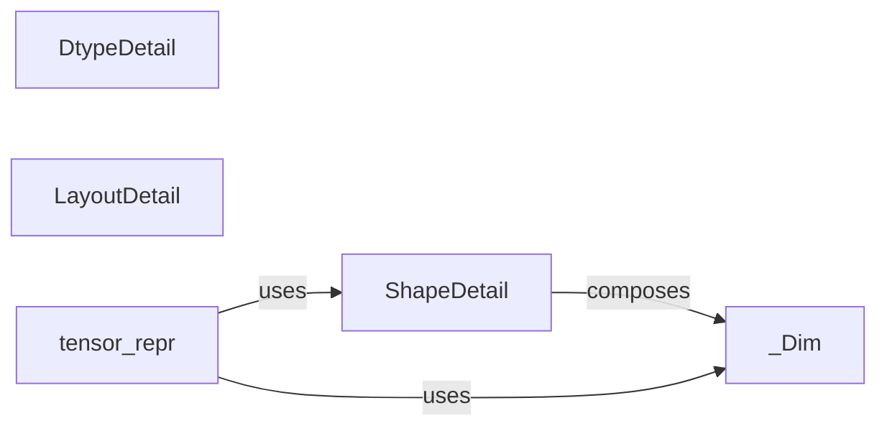

## Details

The Tensor Detail Management (TDM) subsystem is primarily defined by the torchtyping.tensor_details module. Its core function is to establish the foundational data structures and internal models necessary for representing detailed tensor information, such as dimensions, shapes, data types, and memory layouts. It serves as the internal knowledge base for tensor constraints within the torchtyping library.

### _Dim
Represents an atomic unit of a tensor's shape, capable of holding either a symbolic name (e.g., "batch", "channels") or a concrete integer size. It is a fundamental building block for defining flexible and expressive tensor dimensions within the type system.

**Related Classes/Methods**:

- <a href="https://github.com/patrick-kidger/torchtyping/blob/master/torchtyping/typechecker.py" target="_blank" rel="noopener noreferrer">`_Dim`</a>

### ShapeDetail
Encapsulates the complete shape information of a tensor. It is a composite structure that aggregates multiple _Dim instances, providing a structured and ordered representation of the tensor's dimensions.

**Related Classes/Methods**:

- <a href="https://github.com/patrick-kidger/torchtyping/blob/master/torchtyping/tensor_details.py#L55-L124" target="_blank" rel="noopener noreferrer">`ShapeDetail`:55-124</a>

### DtypeDetail
Represents the data type (e.g., torch.float32, torch.int64) of a tensor. It provides a standardized internal model for storing and accessing the element type, essential for type-checking and validation.

**Related Classes/Methods**:

- <a href="https://github.com/patrick-kidger/torchtyping/blob/master/torchtyping/tensor_details.py#L127-L141" target="_blank" rel="noopener noreferrer">`DtypeDetail`:127-141</a>

### LayoutDetail
Represents the memory layout (e.g., torch.strided, torch.sparse_coo) of a tensor. It captures how the tensor's data is organized in memory, which can be relevant for advanced type constraints and performance considerations.

**Related Classes/Methods**:

- <a href="https://github.com/patrick-kidger/torchtyping/blob/master/torchtyping/tensor_details.py#L144-L157" target="_blank" rel="noopener noreferrer">`LayoutDetail`:144-157</a>

### tensor_repr
A utility function designed to generate human-readable string representations of various tensor details, specifically for _Dim instances and the overall ShapeDetail. It supports debugging and provides clear feedback to users about tensor types.

**Related Classes/Methods**:

- <a href="https://github.com/patrick-kidger/torchtyping/blob/master/torchtyping/tensor_details.py#L183-L185" target="_blank" rel="noopener noreferrer">`tensor_repr`:183-185</a>

### [FAQ](https://github.com/CodeBoarding/GeneratedOnBoardings/tree/main?tab=readme-ov-file#faq)