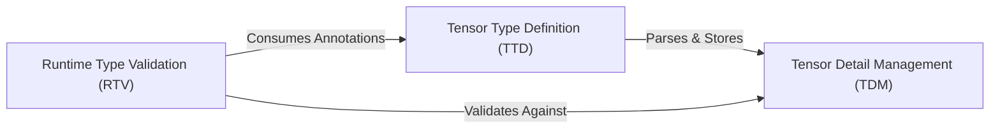

## Details

The `torchtyping` project is designed as a lightweight, extensible library that augments PyTorch with advanced type-checking capabilities for tensors. Its architecture is characterized by a clear separation of concerns, enabling a modular and non-invasive integration into existing machine learning workflows. The system begins with the **Tensor Type Definition (TTD)** component, which serves as the primary interface for users to express tensor constraints through type annotations. These annotations are then meticulously parsed and transformed into a structured, internal representation managed by the **Tensor Detail Management (TDM)** component, which acts as the central repository for all detailed tensor specifications. Finally, the **Runtime Type Validation (RTV)** component leverages these precise specifications from TDM, along with the original annotations from TTD, to dynamically validate tensor operations at runtime, often integrating with external type-checking frameworks like `typeguard`. This architectural approach ensures that `torchtyping` provides robust type safety without disrupting the core PyTorch development experience, making it an ideal enhancement layer for building more reliable and maintainable deep learning models.

### Tensor Type Definition (TTD)
This component is the user-facing API for defining tensor constraints using `TensorType` annotations. It handles the initial parsing of these annotations into a structured format.

**Related Classes/Methods**:

- <a href="https://github.com/patrick-kidger/torchtyping/blob/master/torchtyping/tensor_type.py#L85-L175" target="_blank" rel="noopener noreferrer">`torchtyping.tensor_type.__class_getitem__`:85-175</a>
- <a href="https://github.com/patrick-kidger/torchtyping/blob/master/torchtyping/tensor_type.py#L49-L72" target="_blank" rel="noopener noreferrer">`torchtyping.tensor_type._convert_shape_element`:49-72</a>
- <a href="https://github.com/patrick-kidger/torchtyping/blob/master/torchtyping/tensor_type.py#L74-L83" target="_blank" rel="noopener noreferrer">`torchtyping.tensor_type._convert_dtype_element`:74-83</a>

### Tensor Detail Management (TDM) [[Expand]](./Tensor_Detail_Management_TDM_.md)
This component provides the foundational data structures and internal models for representing detailed tensor information, such as dimensions, shapes, data types, and layouts. It acts as the internal knowledge base for tensor constraints.

**Related Classes/Methods**:

- <a href="https://github.com/patrick-kidger/torchtyping/blob/master/torchtyping/tensor_details.py#L32-L52" target="_blank" rel="noopener noreferrer">`torchtyping.tensor_details._Dim`:32-52</a>
- <a href="https://github.com/patrick-kidger/torchtyping/blob/master/torchtyping/tensor_details.py#L55-L124" target="_blank" rel="noopener noreferrer">`torchtyping.tensor_details.ShapeDetail`:55-124</a>
- <a href="https://github.com/patrick-kidger/torchtyping/blob/master/torchtyping/tensor_details.py#L127-L141" target="_blank" rel="noopener noreferrer">`torchtyping.tensor_details.DtypeDetail`:127-141</a>
- <a href="https://github.com/patrick-kidger/torchtyping/blob/master/torchtyping/tensor_details.py#L144-L157" target="_blank" rel="noopener noreferrer">`torchtyping.tensor_details.LayoutDetail`:144-157</a>
- <a href="https://github.com/patrick-kidger/torchtyping/blob/master/torchtyping/tensor_details.py#L183-L185" target="_blank" rel="noopener noreferrer">`torchtyping.tensor_details.tensor_repr`:183-185</a>

### Runtime Type Validation (RTV) [[Expand]](./Runtime_Type_Validation_RTV_.md)
This component orchestrates and executes the runtime checks for tensors based on the defined `TensorType` annotations. It integrates with external type-checking libraries to perform the actual validation and includes performance optimizations like memoization.

**Related Classes/Methods**:

- <a href="https://github.com/patrick-kidger/torchtyping/blob/master/torchtyping/typechecker.py#L329-L343" target="_blank" rel="noopener noreferrer">`torchtyping.typechecker.check_argument_types`:329-343</a>
- <a href="https://github.com/patrick-kidger/torchtyping/blob/master/torchtyping/typechecker.py#L345-L360" target="_blank" rel="noopener noreferrer">`torchtyping.typechecker.check_return_type`:345-360</a>
- <a href="https://github.com/patrick-kidger/torchtyping/blob/master/torchtyping/typechecker.py#L90-L257" target="_blank" rel="noopener noreferrer">`torchtyping.typechecker._check_memo`:90-257</a>
- <a href="https://github.com/patrick-kidger/torchtyping/blob/master/torchtyping/typechecker.py#L62-L87" target="_blank" rel="noopener noreferrer">`torchtyping.typechecker._check_tensor`:62-87</a>

### [FAQ](https://github.com/CodeBoarding/GeneratedOnBoardings/tree/main?tab=readme-ov-file#faq)