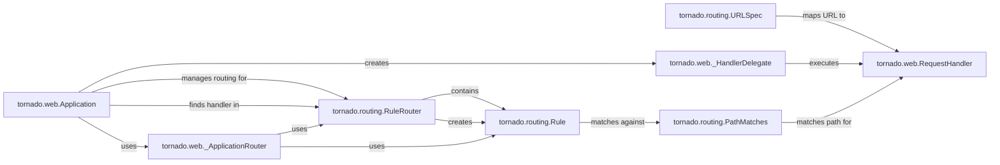

## Component Details

The Application Routing & Dispatching component in Tornado is responsible for directing incoming HTTP requests to the appropriate handler. It starts with the `tornado.web.Application` which receives the request and uses its internal router (`_ApplicationRouter` which defaults to `RuleRouter`) to find a matching handler based on the URL. The `RuleRouter` iterates through a list of `Rule` objects, each containing a matcher (like `PathMatches`) and a target (a `_HandlerDelegate`). If a `PathMatches` object finds a match between the request's URL path and its regular expression, the corresponding `_HandlerDelegate` is used to instantiate and execute the `RequestHandler`. The `RequestHandler` then processes the request and generates a response.

### tornado.web.Application
The Application class is the central point of a Tornado web application. It initializes the routing mechanism, manages application settings, and oversees the request handling lifecycle. It holds a reference to the router and is responsible for creating handler delegates.
- **Related Classes/Methods**: `tornado.web.Application`

### tornado.routing.RuleRouter
The RuleRouter manages a collection of routing rules. It receives a request and iterates through its rules to find a matching handler. It implements the routing logic by matching the request path against the defined rules.
- **Related Classes/Methods**: `tornado.routing.RuleRouter`

### tornado.routing.URLSpec
URLSpec defines a single URL pattern and its associated handler. It encapsulates the regular expression used to match the URL, the handler class to be invoked, and any initialization arguments for the handler. It's a convenient way to define simple routes.
- **Related Classes/Methods**: `tornado.routing.URLSpec`

### tornado.web.RequestHandler
RequestHandler is the base class for all HTTP request handlers. It provides methods for accessing request data (headers, body, query parameters), setting response headers, writing response content, and implementing HTTP methods (GET, POST, etc.).
- **Related Classes/Methods**: `tornado.web.RequestHandler`

### tornado.web._HandlerDelegate
The _HandlerDelegate is responsible for preparing and executing a RequestHandler. It instantiates the handler, calls the appropriate HTTP method (e.g., get, post), and ensures the response is properly finished. It acts as an intermediary between the router and the handler.
- **Related Classes/Methods**: `tornado.web._HandlerDelegate`

### tornado.routing.Rule
A Rule associates a matcher (like PathMatches) with a target (like a handler delegate). It's a fundamental unit in the routing process, defining how a specific URL pattern maps to a handler.
- **Related Classes/Methods**: `tornado.routing.Rule`

### tornado.routing.PathMatches
PathMatches is a matcher that checks if a URL path matches a given regular expression. It's used within Rules to determine if a rule applies to a specific request, enabling flexible URL matching.
- **Related Classes/Methods**: `tornado.routing.PathMatches`

### tornado.web._ApplicationRouter
The _ApplicationRouter is a specialized router used by the Application class. It manages the routing rules specific to the application, providing a dedicated routing context.
- **Related Classes/Methods**: `tornado.web._ApplicationRouter`
