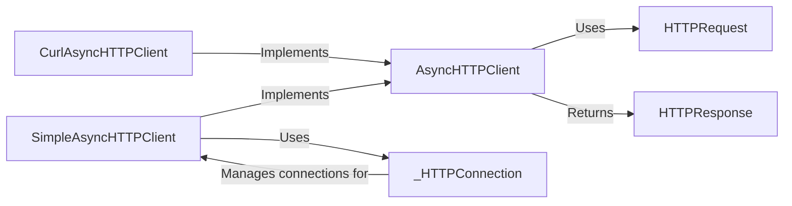

## Component Details

The Asynchronous HTTP Client component in Tornado enables applications to perform non-blocking HTTP requests to external services. It provides an abstract interface (`AsyncHTTPClient`) with concrete implementations like `SimpleAsyncHTTPClient` (pure Python) and `CurlAsyncHTTPClient` (using libcurl). Requests are represented by `HTTPRequest` objects, and responses are returned as `HTTPResponse` objects. The `_HTTPConnection` manages individual HTTP connections for the `SimpleAsyncHTTPClient`, handling connection establishment, data transfer, and connection closing. This system allows Tornado applications to interact with external APIs and resources efficiently without blocking the main event loop.

### AsyncHTTPClient
Abstract base class defining the interface for asynchronous HTTP clients. It specifies the `fetch` method for making requests and handles configuration options common to all HTTP client implementations.
- **Related Classes/Methods**: `tornado.httpclient.AsyncHTTPClient`

### HTTPRequest
Represents an HTTP request, encapsulating the URL, headers, body, method, and other parameters needed to initiate an HTTP request. It's used as input to the `AsyncHTTPClient.fetch` method.
- **Related Classes/Methods**: `tornado.httpclient.HTTPRequest`

### HTTPResponse
Represents an HTTP response received from a server. It contains the status code, headers, body, and other relevant information about the response. It is returned by the `AsyncHTTPClient.fetch` method.
- **Related Classes/Methods**: `tornado.httpclient.HTTPResponse`

### SimpleAsyncHTTPClient
A concrete implementation of `AsyncHTTPClient` that uses Tornado's `iostream` and related modules for performing HTTP requests. It's a pure-Python implementation, offering portability and ease of understanding.
- **Related Classes/Methods**: `tornado.simple_httpclient.SimpleAsyncHTTPClient`

### _HTTPConnection
Manages a single HTTP connection for `SimpleAsyncHTTPClient`. It handles connection establishment, request sending, response receiving, and connection closing, including handling timeouts and errors.
- **Related Classes/Methods**: `tornado.simple_httpclient._HTTPConnection`

### CurlAsyncHTTPClient
A concrete implementation of `AsyncHTTPClient` that leverages the libcurl library for performing HTTP requests. It provides high performance and supports a wide range of HTTP features.
- **Related Classes/Methods**: `tornado.curl_httpclient.CurlAsyncHTTPClient`
