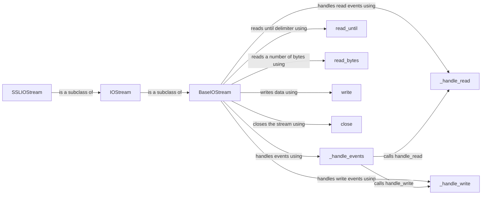

## Component Details

The Asynchronous I/O Stream component in Tornado provides a non-blocking interface for reading and writing data over sockets. It abstracts away the complexities of interacting with the operating system's event loop, allowing developers to focus on the application logic. The core of this component revolves around the `BaseIOStream` class, which defines the fundamental operations for asynchronous I/O. Concrete implementations like `IOStream` and `SSLIOStream` extend `BaseIOStream` to provide specific functionalities for plain TCP sockets and SSL-encrypted sockets, respectively. The component relies on the IOLoop to monitor socket events and trigger appropriate handlers for reading and writing data.

### BaseIOStream
Abstract base class that defines the interface for asynchronous I/O streams. It provides methods for reading and writing data, handling events, and managing the connection state. It interacts with the IOLoop to monitor the socket for readability and writability.
- **Related Classes/Methods**: `tornado.iostream.BaseIOStream`, `tornado.iostream._handle_events`, `tornado.iostream._handle_read`, `tornado.iostream._handle_write`, `tornado.iostream.read_until`, `tornado.iostream.read_bytes`, `tornado.iostream.write`, `tornado.iostream.close`, `tornado.iostream._read_to_buffer_loop`, `tornado.iostream._start_read`, `tornado.iostream._try_inline_read`, `tornado.iostream._read_to_buffer`, `tornado.iostream._read_from_buffer`

### IOStream
A concrete implementation of `BaseIOStream` that works with sockets. It provides methods for connecting to a server and setting socket options. It inherits the read/write functionality from `BaseIOStream` and adapts it to work with sockets.
- **Related Classes/Methods**: `tornado.iostream.IOStream`, `tornado.iostream.connect`

### SSLIOStream
A subclass of `IOStream` that adds SSL/TLS encryption to the stream. It handles the SSL handshake process and encrypts/decrypts data as it is read from or written to the underlying socket. It interacts with the `ssl` module to perform the encryption and decryption operations.
- **Related Classes/Methods**: `tornado.iostream.SSLIOStream`, `tornado.iostream.connect`

### _handle_events
This method is responsible for handling IOLoop events (read/write). It determines whether a read or write operation is possible and calls the corresponding handler methods (`_handle_read` or `_handle_write`).
- **Related Classes/Methods**: `tornado.iostream.BaseIOStream._handle_events`

### _handle_read
This method is called when the socket is ready for reading. It attempts to read data from the socket and adds it to the read buffer. It then calls the appropriate callback function to process the data.
- **Related Classes/Methods**: `tornado.iostream.BaseIOStream._handle_read`

### _handle_write
This method is called when the socket is ready for writing. It attempts to write data from the write buffer to the socket.
- **Related Classes/Methods**: `tornado.iostream.BaseIOStream._handle_write`

### read_until
Reads from the stream until a given delimiter is found.
- **Related Classes/Methods**: `tornado.iostream.BaseIOStream.read_until`

### read_bytes
Reads a specified number of bytes from the stream.
- **Related Classes/Methods**: `tornado.iostream.BaseIOStream.read_bytes`

### write
Writes data to the stream.
- **Related Classes/Methods**: `tornado.iostream.BaseIOStream.write`

### close
Closes the stream.
- **Related Classes/Methods**: `tornado.iostream.BaseIOStream.close`
