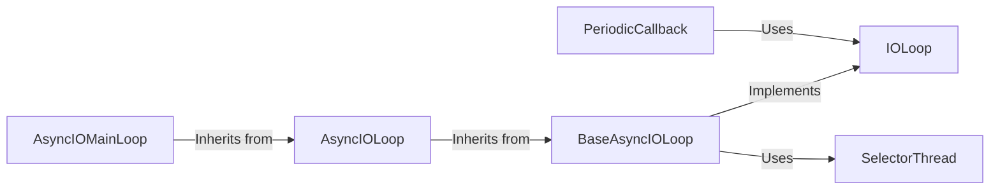

## Component Details

The Tornado IOLoop and event management system form the core of Tornado's asynchronous capabilities. The IOLoop class is central, managing the event loop and scheduling callbacks for I/O events. It provides methods for scheduling tasks, both within the IOLoop's thread and in separate thread pools. PeriodicCallback allows for repeated execution of callbacks at fixed intervals. For integration with asyncio, BaseAsyncIOLoop adapts the Tornado IOLoop interface to the asyncio event loop, with AsyncIOLoop providing a bridge between Tornado and asyncio. SelectorThread manages a separate thread for the asyncio event loop to prevent blocking the main thread. These components work together to enable non-blocking I/O and efficient asynchronous programming in Tornado.

### IOLoop
The IOLoop class is the core of Tornado's asynchronous functionality. It manages the event loop, monitoring file descriptors for events and scheduling callbacks to be executed when those events occur. It also provides methods for scheduling tasks to be run later, either in the IOLoop's thread or in a separate thread pool.
- **Related Classes/Methods**: `tornado.ioloop.IOLoop`

### PeriodicCallback
The PeriodicCallback class provides a way to schedule a callback function to be executed repeatedly at a fixed interval. It uses the IOLoop to schedule the callback, and it can be started and stopped as needed.
- **Related Classes/Methods**: `tornado.ioloop.PeriodicCallback`

### BaseAsyncIOLoop
Base class for asyncio-based IOLoop implementations. It adapts the Tornado IOLoop interface to the asyncio event loop. It handles adding, updating, and removing handlers for file descriptors.
- **Related Classes/Methods**: `tornado.platform.asyncio.BaseAsyncIOLoop`

### AsyncIOMainLoop
A specialized AsyncIOLoop that integrates with the asyncio main loop. It ensures that Tornado's IOLoop runs within the asyncio environment.
- **Related Classes/Methods**: `tornado.platform.asyncio.AsyncIOMainLoop`

### AsyncIOLoop
An IOLoop implementation that uses the asyncio event loop. It provides a bridge between Tornado's asynchronous programming model and asyncio's.
- **Related Classes/Methods**: `tornado.platform.asyncio.AsyncIOLoop`

### SelectorThread
The SelectorThread class manages a separate thread for running the asyncio event loop. This is used to avoid blocking the main thread when performing I/O operations.
- **Related Classes/Methods**: `tornado.platform.asyncio.SelectorThread`
