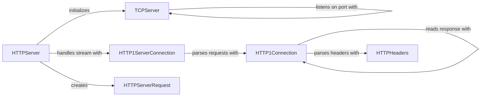

## Component Details

The HTTP Server & Connection Management subsystem in Tornado is responsible for handling incoming HTTP requests. It starts with the `TCPServer` accepting connections, which are then passed to the `HTTPServer`. The `HTTPServer` creates `HTTP1ServerConnection` instances to manage individual HTTP/1.x connections. `HTTP1ServerConnection` uses `HTTP1Connection` to parse requests and responses, utilizing `HTTPHeaders` to manage header information. Finally, `HTTPServerRequest` encapsulates the details of each incoming request.

### TCPServer
The `TCPServer` class is a base class for TCP servers. It provides the foundation for accepting incoming network connections. It listens on a specified port and delegates the handling of connections to a connection-specific class.
- **Related Classes/Methods**: `tornado.tcpserver.TCPServer`

### HTTPServer
The `HTTPServer` class is responsible for accepting incoming connections and creating HTTP connections to handle them. It inherits from `TCPServer` and builds upon its functionality to provide HTTP-specific features. It listens on a specified port and binds to an address, delegating the handling of individual connections to connection-specific classes.
- **Related Classes/Methods**: `tornado.httpserver.HTTPServer`

### HTTP1ServerConnection
The `HTTP1ServerConnection` class handles the lifecycle of a single HTTP/1.x connection. It reads incoming requests, parses them, and sends them to the application for processing. It also manages the response and writes it back to the client. It handles connection keep-alive and closing.
- **Related Classes/Methods**: `tornado.http1connection.HTTP1ServerConnection`

### HTTP1Connection
The `HTTP1Connection` class is responsible for reading and writing HTTP/1.x messages on a socket. It handles parsing headers, reading the request body, and formatting the response. It also manages connection state, such as keep-alive and closing.
- **Related Classes/Methods**: `tornado.http1connection.HTTP1Connection`

### HTTPServerRequest
The `HTTPServerRequest` class represents an HTTP request received by the server. It contains information about the request, such as the method, URI, headers, and body. It provides methods for accessing and manipulating this information.
- **Related Classes/Methods**: `tornado.httputil.HTTPServerRequest`

### HTTPHeaders
The `HTTPHeaders` class is a dictionary-like object that stores HTTP headers. It provides methods for adding, getting, and setting header values. It also supports parsing headers from a string.
- **Related Classes/Methods**: `tornado.httputil.HTTPHeaders`
