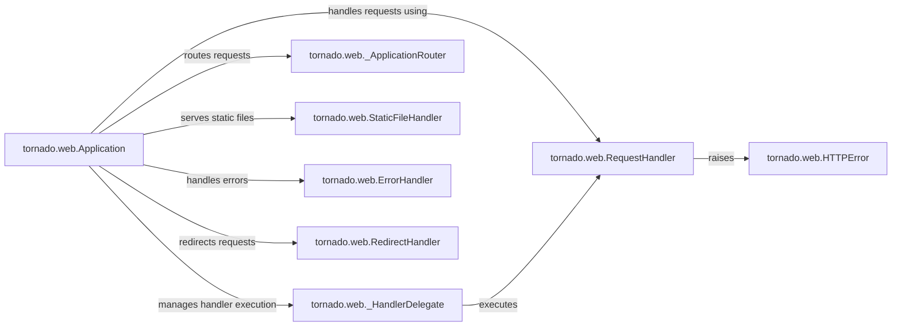

## Component Details

The Request Handling & Processing subsystem in Tornado is responsible for receiving HTTP requests, routing them to the appropriate handler, executing the handler logic, and returning a response to the client. The `tornado.web.Application` acts as the central point, mapping URLs to handlers. `RequestHandler` is the base class for all handlers, providing methods for accessing request data and generating responses. Helper classes like `_HandlerDelegate` and `_ApplicationRouter` manage handler execution and routing, respectively. Error handling is facilitated by `HTTPError` and `ErrorHandler`, while `StaticFileHandler` and `RedirectHandler` provide specialized handling for static files and redirects. Template rendering is supported through `TemplateModule` and utility functions in `tornado.web`.

### tornado.web.RequestHandler
The base class for handling HTTP requests. It provides methods for accessing request data (arguments, headers, cookies), setting response headers and cookies, writing the response body, and handling errors. User-defined handlers inherit from this class and override methods like `get`, `post`, etc., to implement specific application logic for different HTTP methods.
- **Related Classes/Methods**: `tornado.web.RequestHandler`

### tornado.web.Application
The central class that represents a Tornado web application. It maps incoming requests to appropriate handler classes based on URL patterns defined in its handler list. It also manages application-level settings, such as cookie secrets and template paths, and provides methods for starting the application's server.
- **Related Classes/Methods**: `tornado.web.Application`

### tornado.web._HandlerDelegate
A helper class used internally by `Application` to manage the execution of a request handler. It encapsulates the handler instance and ensures that the request is properly finished, including calling `on_finish` and handling exceptions.
- **Related Classes/Methods**: `tornado.web._HandlerDelegate`

### tornado.web._ApplicationRouter
A class responsible for routing requests to the appropriate handler based on the URL pattern. It processes the routing rules defined in the application's handler list.
- **Related Classes/Methods**: `tornado.web._ApplicationRouter`

### tornado.web.HTTPError
An exception class used to signal HTTP errors. Handlers can raise this exception to return an error response to the client, specifying the HTTP status code and an optional reason.
- **Related Classes/Methods**: `tornado.web.HTTPError`

### tornado.web.StaticFileHandler
A handler for serving static files, such as images, CSS, and JavaScript. It provides features like caching, ETag support, and security checks to prevent directory traversal.
- **Related Classes/Methods**: `tornado.web.StaticFileHandler`

### tornado.web.ErrorHandler
A default handler for serving error pages. It is used when no other handler matches the requested URL or when an error occurs during request processing. It typically renders a simple error message with the HTTP status code.
- **Related Classes/Methods**: `tornado.web.ErrorHandler`

### tornado.web.RedirectHandler
A handler that redirects the client to a different URL. It can perform permanent or temporary redirects, and the target URL can be specified directly or dynamically based on the request.
- **Related Classes/Methods**: `tornado.web.RedirectHandler`
