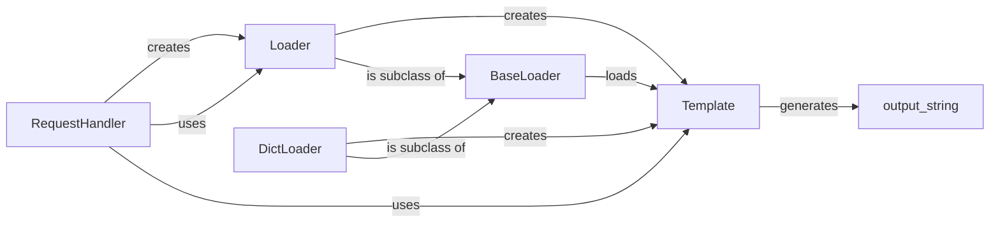

## Component Details

The Template Rendering Engine in Tornado is responsible for generating dynamic web pages by combining templates with data. The core components include the Template class, which compiles and renders templates, and Loader classes (BaseLoader, Loader, DictLoader), which handle template loading from various sources like the filesystem or dictionaries. RequestHandler integrates with these components to provide a convenient way to render templates within HTTP request handlers. The process involves a RequestHandler creating or using a Loader to fetch a Template, passing data to the Template's generate method, and sending the rendered output to the client.

### Template
Represents a compiled template. It takes template text as input, parses it, and provides a `generate` method to render the template with a given context. The template compilation involves converting the template syntax into executable Python code.
- **Related Classes/Methods**: `tornado.template.Template`, `tornado.template.Template.__init__`, `tornado.template.Template.generate`

### BaseLoader
Abstract base class for template loaders. Defines the interface for loading templates. Subclasses implement the actual loading mechanism, such as from the filesystem or a database.
- **Related Classes/Methods**: `tornado.template.BaseLoader`, `tornado.template.BaseLoader.load`

### Loader
Loads templates from a root directory on the filesystem. It caches compiled templates for efficiency. When a template is requested, the Loader checks if it's already cached; if not, it reads the template file, compiles it into a Template object, and stores it in the cache.
- **Related Classes/Methods**: `tornado.template.Loader`, `tornado.template.Loader.__init__`, `tornado.template.Loader._create_template`

### DictLoader
Loads templates from a dictionary. Useful for testing or embedding templates directly in code. It's a simple loader that retrieves templates directly from a provided dictionary, compiling them into Template objects.
- **Related Classes/Methods**: `tornado.template.DictLoader`, `tornado.template.DictLoader.__init__`, `tornado.template.DictLoader._create_template`

### RequestHandler
Base class for HTTP request handlers. Provides methods for rendering templates, including `render` and `render_string`. The `render` method uses a Loader to load the template and then calls the template's `generate` method to produce the output, which is then sent as the response to the client.
- **Related Classes/Methods**: `tornado.web.RequestHandler`, `tornado.web.RequestHandler.render`, `tornado.web.RequestHandler.render_string`, `tornado.web.RequestHandler.create_template_loader`
