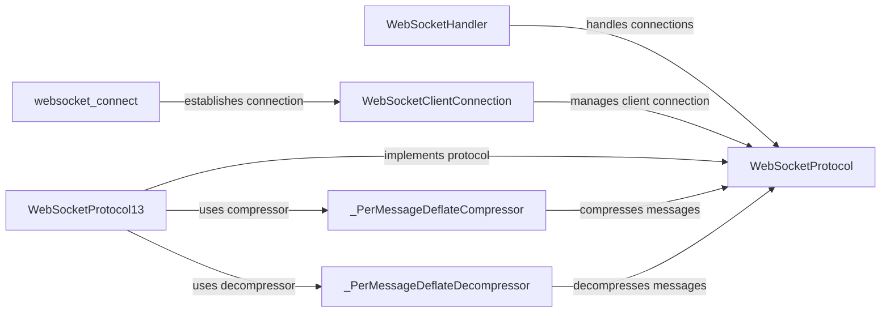

## Component Details

The WebSocket communication handler in Tornado facilitates real-time, bidirectional communication between clients and servers. It encompasses server-side handling via `WebSocketHandler`, client-side connection management through `WebSocketClientConnection`, and protocol implementation in `WebSocketProtocol` and its variants. Compression extensions, handled by `_PerMessageDeflateCompressor` and `_PerMessageDeflateDecompressor`, optimize bandwidth usage. The `websocket_connect` function initiates client connections. This system enables applications to provide features like live updates and interactive chat.

### WebSocketHandler
This class serves as the foundation for handling WebSocket connections on the server. It defines the interface for managing incoming messages, closing connections, and sending data to the client. Developers subclass this to implement specific application logic.
- **Related Classes/Methods**: `tornado.websocket.WebSocketHandler`

### WebSocketProtocol
This class encapsulates the core WebSocket protocol logic. It manages the framing and deframing of WebSocket messages, handling the low-level details of the communication. It also maintains the connection state and manages extensions.
- **Related Classes/Methods**: `tornado.websocket.WebSocketProtocol`

### WebSocketProtocol13
This class implements version 13 of the WebSocket protocol, the most prevalent version. It extends `WebSocketProtocol` with version-specific logic, including handshake procedures and extension handling.
- **Related Classes/Methods**: `tornado.websocket.WebSocketProtocol13`

### WebSocketClientConnection
This class manages WebSocket connections on the client side. It handles establishing the connection to the server, sending and receiving messages, and managing the connection lifecycle, including closing the connection.
- **Related Classes/Methods**: `tornado.websocket.WebSocketClientConnection`

### websocket_connect
This function is used by clients to initiate a WebSocket connection to a server. It returns a Future that resolves to a `WebSocketClientConnection` object upon successful connection.
- **Related Classes/Methods**: `tornado.websocket.websocket_connect`

### _PerMessageDeflateCompressor
This class implements the permessage-deflate compression extension for WebSocket. It compresses outgoing messages to reduce bandwidth consumption.
- **Related Classes/Methods**: `tornado.websocket._PerMessageDeflateCompressor`

### _PerMessageDeflateDecompressor
This class implements the permessage-deflate compression extension for WebSocket. It decompresses incoming messages that have been compressed using the permessage-deflate extension.
- **Related Classes/Methods**: `tornado.websocket._PerMessageDeflateDecompressor`
