```mermaid
graph LR
    Core_IOLoop_Event_Management["Core IOLoop & Event Management"]
    HTTP_Server_Connection_Management["HTTP Server & Connection Management"]
    Request_Handling_Processing["Request Handling & Processing"]
    Application_Routing_Dispatching["Application Routing & Dispatching"]
    Template_Rendering_Engine["Template Rendering Engine"]
    Asynchronous_HTTP_Client["Asynchronous HTTP Client"]
    WebSocket_Communication_Handler["WebSocket Communication Handler"]
    Asynchronous_I_O_Stream["Asynchronous I/O Stream"]
    Core_IOLoop_Event_Management -- "manages" --> HTTP_Server_Connection_Management
    Core_IOLoop_Event_Management -- "manages" --> Asynchronous_I_O_Stream
    HTTP_Server_Connection_Management -- "handles requests through" --> Request_Handling_Processing
    Application_Routing_Dispatching -- "routes requests to" --> Request_Handling_Processing
    Request_Handling_Processing -- "uses" --> Template_Rendering_Engine
    Request_Handling_Processing -- "makes requests with" --> Asynchronous_HTTP_Client
    HTTP_Server_Connection_Management -- "handles connections through" --> Asynchronous_I_O_Stream
    Asynchronous_HTTP_Client -- "uses" --> Asynchronous_I_O_Stream
    HTTP_Server_Connection_Management -- "handles connections through" --> WebSocket_Communication_Handler
    WebSocket_Communication_Handler -- "uses" --> Asynchronous_I_O_Stream
    click Core_IOLoop_Event_Management href "https://github.com/CodeBoarding/GeneratedOnBoardings/blob/main/tornado/Core IOLoop & Event Management.md" "Details"
    click HTTP_Server_Connection_Management href "https://github.com/CodeBoarding/GeneratedOnBoardings/blob/main/tornado/HTTP Server & Connection Management.md" "Details"
    click Request_Handling_Processing href "https://github.com/CodeBoarding/GeneratedOnBoardings/blob/main/tornado/Request Handling & Processing.md" "Details"
    click Application_Routing_Dispatching href "https://github.com/CodeBoarding/GeneratedOnBoardings/blob/main/tornado/Application Routing & Dispatching.md" "Details"
    click Template_Rendering_Engine href "https://github.com/CodeBoarding/GeneratedOnBoardings/blob/main/tornado/Template Rendering Engine.md" "Details"
    click Asynchronous_HTTP_Client href "https://github.com/CodeBoarding/GeneratedOnBoardings/blob/main/tornado/Asynchronous HTTP Client.md" "Details"
    click WebSocket_Communication_Handler href "https://github.com/CodeBoarding/GeneratedOnBoardings/blob/main/tornado/WebSocket Communication Handler.md" "Details"
    click Asynchronous_I_O_Stream href "https://github.com/CodeBoarding/GeneratedOnBoardings/blob/main/tornado/Asynchronous I/O Stream.md" "Details"
```

## Component Details

Tornado is a Python web framework and asynchronous networking library. At its core, it provides a non-blocking I/O event loop that enables high concurrency. The framework includes components for building web applications, handling HTTP requests and responses, templating, and WebSocket communication. It also offers an HTTP client for making asynchronous requests to external services. Tornado's architecture is designed to handle a large number of concurrent connections efficiently, making it suitable for real-time applications and APIs.

### Core IOLoop & Event Management
This component is the foundation of Tornado's asynchronous operations. It manages the event loop, schedules callbacks, and handles I/O events, enabling non-blocking operations. It integrates with platform-specific event loops and provides the core functionality for asynchronous programming in Tornado.
- **Related Classes/Methods**: `tornado.ioloop.IOLoop`, `tornado.platform.asyncio.BaseAsyncIOLoop`, `tornado.platform.asyncio.AsyncIOLoop`

### HTTP Server & Connection Management
This component is responsible for accepting incoming HTTP connections, parsing requests, and managing the lifecycle of HTTP connections. It handles the low-level details of HTTP communication, including keep-alive connections and request pipelining. It uses HTTP1Connection for handling HTTP/1.1 connections and provides the server-side functionality for handling HTTP requests.
- **Related Classes/Methods**: `tornado.httpserver.HTTPServer`, `tornado.httputil.HTTPServerRequest`, `tornado.httputil.HTTPHeaders`, `tornado.http1connection.HTTP1ServerConnection`

### Request Handling & Processing
This component provides the base class for all HTTP request handlers in Tornado. It offers methods for accessing request data, setting response headers, rendering templates, and writing responses. Subclasses implement specific request handling logic for different URLs and HTTP methods, providing the application-specific logic for handling web requests.
- **Related Classes/Methods**: `tornado.web.RequestHandler`, `tornado.web.HTTPError`, `tornado.web.MissingArgumentError`

### Application Routing & Dispatching
This component is responsible for mapping incoming HTTP requests to the appropriate request handlers. It uses URL patterns and regular expressions to match requests and dispatches them to the corresponding handler classes. It manages the overall structure of the web application and defines the relationships between URLs and handlers.
- **Related Classes/Methods**: `tornado.web.Application`, `tornado.routing.RuleRouter`, `tornado.routing.URLSpec`, `tornado.web._ApplicationRouter`

### Template Rendering Engine
This component is responsible for rendering dynamic web pages using templates. It supports features like template inheritance, automatic escaping, and custom template functions. It allows developers to create reusable and maintainable web page layouts and dynamically generate HTML content.
- **Related Classes/Methods**: `tornado.template.Template`, `tornado.template.Loader`, `tornado.template.BaseLoader`

### Asynchronous HTTP Client
This component provides asynchronous HTTP client functionality. It allows Tornado applications to make HTTP requests to external services and APIs without blocking the main event loop. It supports features like request timeouts, SSL encryption, and custom headers, enabling efficient communication with external resources.
- **Related Classes/Methods**: `tornado.httpclient.AsyncHTTPClient`, `tornado.httpclient.HTTPRequest`, `tornado.httpclient.HTTPResponse`

### WebSocket Communication Handler
This component provides support for WebSocket connections. It allows Tornado applications to handle bidirectional communication with clients over WebSockets, enabling real-time features like chat and live updates. It manages the WebSocket handshake and message processing, providing a framework for building real-time applications.
- **Related Classes/Methods**: `tornado.websocket.WebSocketHandler`, `tornado.websocket.WebSocketProtocol`, `tornado.websocket.WebSocketClientConnection`

### Asynchronous I/O Stream
This component provides asynchronous I/O functionality for reading and writing data to sockets. It supports features like buffering, timeouts, and SSL encryption. It is used by other components like the HTTP server and client to handle network communication, providing a low-level interface for asynchronous I/O operations.
- **Related Classes/Methods**: `tornado.iostream.IOStream`, `tornado.iostream.BaseIOStream`, `tornado.iostream.SSLIOStream`