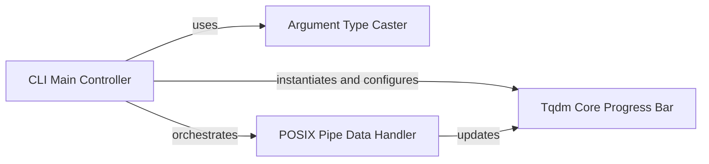

## Component Details

The Command Line Interface (CLI) component for `tqdm` provides a standalone utility that enables users to monitor the progress of non-Python processes or scripts directly from the terminal. It achieves this by piping input from other shell commands and displaying a `tqdm` progress bar. This component is designed for flexibility, allowing various `tqdm` options to be configured via command-line arguments.

### CLI Main Controller
This component serves as the central orchestrator for the `tqdm` command-line utility. It is responsible for parsing all command-line arguments (including `--help`, `--version`, logging configurations, and various `tqdm` specific options). It dynamically configures and instantiates the `Tqdm Core Progress Bar` based on user input. Furthermore, it manages the flow of data from standard input (`sys.stdin`) to standard output (`sys.stdout`), deciding the appropriate data handling mechanism (either direct line-by-line processing or byte-stream processing via the `POSIX Pipe Data Handler`). It also handles special CLI functionalities like installing man pages or shell completion scripts.

**Related Classes/Methods**:

- <a href="https://github.com/tqdm/tqdm/blob/master/tqdm/cli.py#L1-L1" target="_blank" rel="noopener noreferrer">`tqdm.cli:main` (1:1)</a>

### Argument Type Caster
This utility component is dedicated to safely converting string values obtained from command-line arguments into their correct Python data types (e.g., boolean, character, string, integer, float). It incorporates error handling to manage invalid type conversions, ensuring that the `Tqdm Core Progress Bar` receives parameters in the expected format.

**Related Classes/Methods**:

- <a href="https://github.com/tqdm/tqdm/blob/master/tqdm/cli.py#L1-L1" target="_blank" rel="noopener noreferrer">`tqdm.cli:cast` (1:1)</a>

### POSIX Pipe Data Handler
This component specializes in the efficient streaming of binary data from an input file-like object (typically `sys.stdin.buffer`) to an output file-like object (typically `sys.stdout.buffer`). It processes data in configurable chunks and can handle various delimiters (e.g., newlines, or single characters for byte-level processing). It integrates with a callback mechanism to report progress, making it ideal for scenarios where `tqdm` needs to monitor byte streams or delimited data in a pipe-like fashion.

**Related Classes/Methods**:

- <a href="https://github.com/tqdm/tqdm/blob/master/tqdm/cli.py#L1-L1" target="_blank" rel="noopener noreferrer">`tqdm.cli:posix_pipe` (1:1)</a>

### Tqdm Core Progress Bar
This represents the core `tqdm` progress bar functionality. It is instantiated and configured by the `CLI Main Controller` using parameters derived from command-line arguments. It provides methods (e.g., `update`) to increment the progress count and manages the visual display of the progress bar in the terminal. It is the underlying engine responsible for rendering and managing the progress bar's state, receiving updates from data handlers.

**Related Classes/Methods**:

- `tqdm.tqdm:tqdm` (1:1)

### [FAQ](https://github.com/CodeBoarding/GeneratedOnBoardings/tree/main?tab=readme-ov-file#faq)