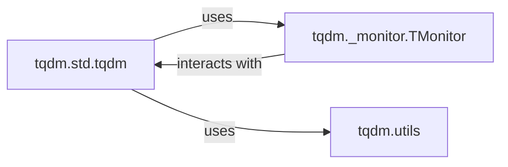

## Component Details

The `tqdm` library's core functionality is primarily driven by three interconnected components: the main `tqdm` class, the `TMonitor` for managing progress bar updates, and a collection of `utils` that provide essential helper functions. These components work in concert to deliver the dynamic and robust progress bar experience `tqdm` is known for.

### tqdm.std.tqdm
This is the central class responsible for the creation, management, and display of individual progress bars. It handles iteration tracking, calculates performance metrics (such as elapsed time and iteration rate), manages dynamic console output, and applies flexible string formatting. It also incorporates mechanisms for thread and multiprocessing safety through locks and interacts with the monitor for synchronized updates.

**Related Classes/Methods**:

- <a href="https://github.com/tqdm/tqdm/blob/master/tqdm/_monitor.py#L14-L94" target="_blank" rel="noopener noreferrer">`tqdm._monitor.TMonitor` (14:94)</a>
- <a href="https://github.com/tqdm/tqdm/blob/master/tqdm/utils.py#L0-L0" target="_blank" rel="noopener noreferrer">`tqdm.utils.disp_len` (0:0)</a>
- <a href="https://github.com/tqdm/tqdm/blob/master/tqdm/utils.py#L0-L0" target="_blank" rel="noopener noreferrer">`tqdm.utils.disp_trim` (0:0)</a>
- <a href="https://github.com/tqdm/tqdm/blob/master/tqdm/utils.py#L0-L0" target="_blank" rel="noopener noreferrer">`tqdm.utils.CallbackIOWrapper` (0:0)</a>
- <a href="https://github.com/tqdm/tqdm/blob/master/tqdm/utils.py#L0-L0" target="_blank" rel="noopener noreferrer">`tqdm.utils.DisableOnWriteError` (0:0)</a>

### tqdm._monitor.TMonitor
This component operates as a background thread dedicated to monitoring active `tqdm` instances. Its primary role is to ensure that multiple progress bars update smoothly without output interference, especially in concurrent environments (multi-threading/multi-processing). It periodically checks `tqdm` instances and forces updates if they are taking too long to print, dynamically adjusting `miniters` to maintain responsiveness.

**Related Classes/Methods**:

- <a href="https://github.com/tqdm/tqdm/blob/master/tqdm/std.py#L0-L0" target="_blank" rel="noopener noreferrer">`tqdm.std.tqdm:refresh` (0:0)</a>
- <a href="https://github.com/tqdm/tqdm/blob/master/tqdm/std.py#L0-L0" target="_blank" rel="noopener noreferrer">`tqdm.std.tqdm` (0:0)</a>

### tqdm.utils
This module provides a suite of foundational utility functions and classes that support the core progress bar engine. Key utilities include `ObjectWrapper` for flexible object wrapping, I/O stream adapters (`SimpleTextIOWrapper`, `DisableOnWriteError`) for handling output streams and error management, and display string utilities (`disp_len`, `disp_trim`) for accurate rendering of strings (including those with ANSI codes) in the terminal. It also includes `envwrap` for environment variable-based configuration overrides.

**Related Classes/Methods**: _None_

### [FAQ](https://github.com/CodeBoarding/GeneratedOnBoardings/tree/main?tab=readme-ov-file#faq)