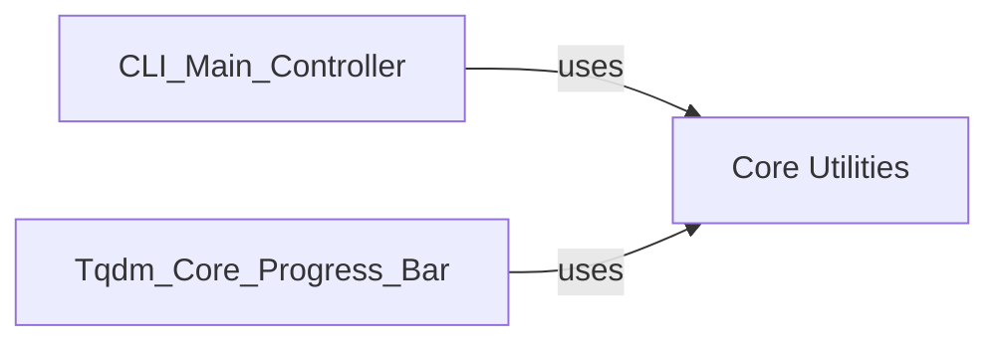

## Component Details

The `Core Utilities` component, specifically `tqdm.utils`, is fundamental because it addresses critical cross-cutting concerns that directly impact the reliability, compatibility, and visual integrity of the `tqdm` progress bar.

1.  **Robust I/O Handling (`SimpleTextIOWrapper`, `DisableOnWriteError`)**: In a command-line utility, interacting with `sys.stdout` or `sys.stderr` can be fraught with issues, especially across different operating systems, terminal emulators, or when pipes are involved.
    *   `SimpleTextIOWrapper` ensures that text is correctly encoded before being written, preventing `UnicodeEncodeError` issues that can arise from mismatched encodings between the application and the terminal.
    *   `DisableOnWriteError` provides a crucial layer of fault tolerance. If the output stream becomes unavailable (e.g., a pipe is broken, or the terminal is closed unexpectedly), `tqdm` would otherwise crash. By disabling the progress bar, it allows the main program to continue execution, making `tqdm` much more resilient in diverse environments. These mechanisms are essential for `tqdm`'s reputation as a "fast, extensible progress bar for Python and CLI."

2.  **Terminal Environment Detection (`_screen_shape_wrapper`, `_supports_unicode`)**: The visual presentation of a progress bar is highly dependent on the terminal environment.
    *   `_screen_shape_wrapper` is vital for `tqdm` to correctly calculate the available width for the progress bar, preventing overflow or underutilization of space. This ensures the progress bar looks good and is readable on various terminal sizes.
    *   `_supports_unicode` allows `tqdm` to intelligently decide whether to use more visually appealing Unicode characters (like block elements) or fall back to ASCII characters. This adaptability is key to `tqdm`'s cross-platform compatibility, ensuring a consistent (though potentially simplified) experience even in environments with limited Unicode support.

These utilities are "core" because they provide the foundational capabilities for `tqdm` to operate reliably and display correctly across a wide range of user environments, directly supporting the `Tqdm Core Progress Bar` and being leveraged by the `CLI Main Controller` for initial setup. Without them, `tqdm` would be significantly less robust and user-friendly.

### Core Utilities
This component provides essential helper classes and functions that support the `tqdm` progress bar engine. It includes robust I/O handling mechanisms such as `SimpleTextIOWrapper` for encoding output and `DisableOnWriteError` to gracefully handle write/flush errors by disabling the progress bar. It also offers functions for detecting terminal characteristics like screen width (`_screen_shape_wrapper`) and Unicode support (`_supports_unicode`), which are crucial for cross-platform compatibility and stable display of the progress bar.

**Related Classes/Methods**:

- <a href="https://github.com/tqdm/tqdm/blob/master/tqdm/utils.py#L0-L0" target="_blank" rel="noopener noreferrer">`tqdm.utils.SimpleTextIOWrapper` (0:0)</a>
- <a href="https://github.com/tqdm/tqdm/blob/master/tqdm/utils.py#L0-L0" target="_blank" rel="noopener noreferrer">`tqdm.utils.DisableOnWriteError` (0:0)</a>
- <a href="https://github.com/tqdm/tqdm/blob/master/tqdm/utils.py#L0-L0" target="_blank" rel="noopener noreferrer">`tqdm.utils._screen_shape_wrapper` (0:0)</a>
- <a href="https://github.com/tqdm/tqdm/blob/master/tqdm/utils.py#L0-L0" target="_blank" rel="noopener noreferrer">`tqdm.utils._supports_unicode` (0:0)</a>

### [FAQ](https://github.com/CodeBoarding/GeneratedOnBoardings/tree/main?tab=readme-ov-file#faq)