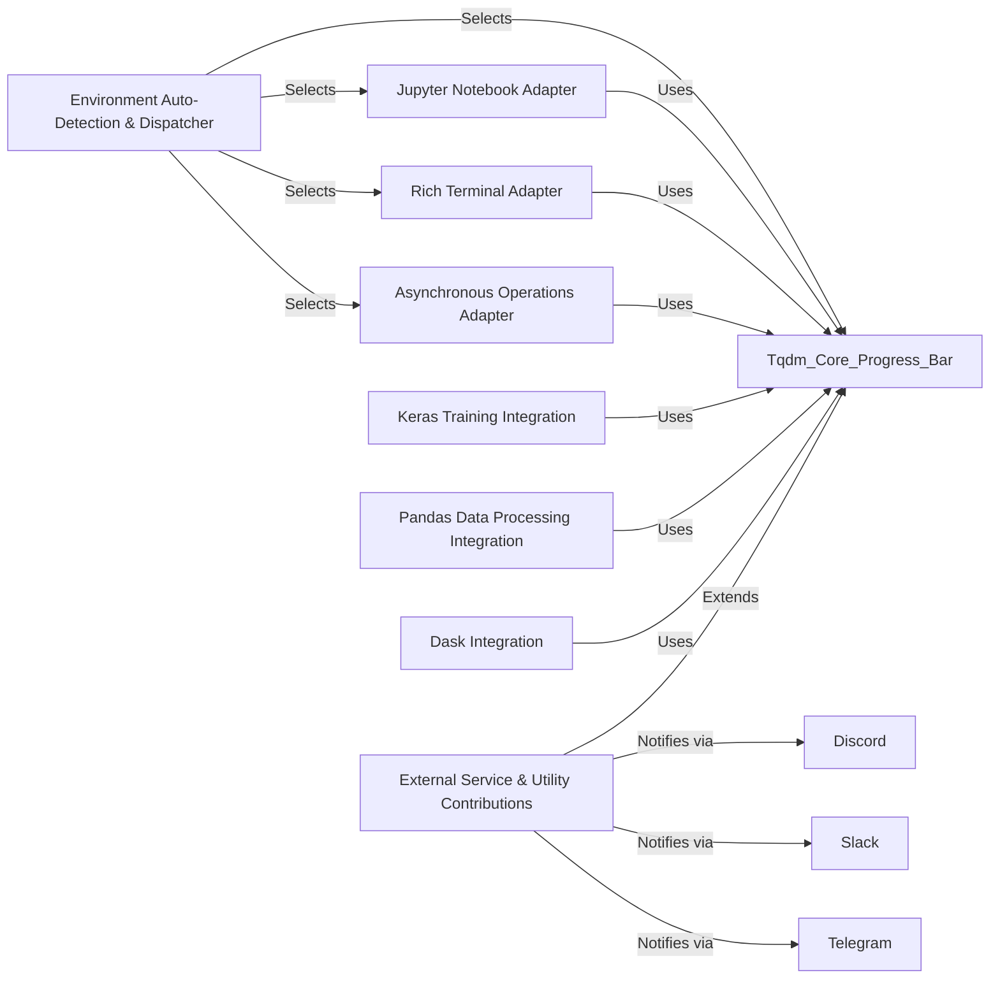

## Component Details

The `Environment Adapters & Integrations` component is crucial for `tqdm`'s versatility, allowing it to function optimally across diverse execution environments and integrate with various external libraries. This component abstracts away environment-specific complexities, providing a unified interface for progress bar display.

### Environment Auto-Detection & Dispatcher
This component intelligently detects the current execution environment (e.g., Jupyter Notebook, standard terminal, `asyncio` loop) and dynamically dispatches the appropriate `tqdm` implementation. It acts as the primary entry point for users who want `tqdm` to automatically adapt to their context, ensuring the best possible progress bar rendering without manual configuration.

**Related Classes/Methods**:

- <a href="https://github.com/tqdm/tqdm/blob/master/tqdm/auto.py#L0-L0" target="_blank" rel="noopener noreferrer">`tqdm.auto` (0:0)</a>

### Jupyter Notebook Adapter
Specifically designed for Jupyter and IPython environments, this component provides a rich, interactive progress bar that leverages Jupyter's display mechanisms. It ensures that `tqdm` progress bars are rendered correctly within notebook cells, offering features like dynamic updates and clear visual feedback in a web-based interface.

**Related Classes/Methods**:

- <a href="https://github.com/tqdm/tqdm/blob/master/tqdm/notebook.py#L0-L0" target="_blank" rel="noopener noreferrer">`tqdm.notebook` (0:0)</a>
- <a href="https://github.com/tqdm/tqdm/blob/master/tqdm/autonotebook.py#L0-L0" target="_blank" rel="noopener noreferrer">`tqdm.autonotebook` (0:0)</a>

### Rich Terminal Adapter
This component integrates `tqdm` with the `rich` library, providing enhanced terminal output capabilities. It allows `tqdm` to leverage `rich`'s advanced rendering features, such as colors, styles, and layout management, for a more visually appealing and informative progress bar in modern terminals.

**Related Classes/Methods**:

- <a href="https://github.com/tqdm/tqdm/blob/master/tqdm/rich.py#L0-L0" target="_blank" rel="noopener noreferrer">`tqdm.rich` (0:0)</a>

### Asynchronous Operations Adapter
This component provides `tqdm` support for asynchronous programming paradigms, specifically with `asyncio`. It allows developers to track the progress of asynchronous tasks and coroutines, ensuring that progress bars update correctly without blocking the event loop.

**Related Classes/Methods**:

- <a href="https://github.com/tqdm/tqdm/blob/master/tqdm/asyncio.py#L0-L0" target="_blank" rel="noopener noreferrer">`tqdm.asyncio` (0:0)</a>

### Keras Training Integration
This component offers a `tqdm` callback specifically designed for integrating with Keras (and TensorFlow Keras) training loops. It allows users to monitor the progress of deep learning model training, displaying epochs, batch progress, and metrics directly within a `tqdm` progress bar.

**Related Classes/Methods**:

- <a href="https://github.com/tqdm/tqdm/blob/master/tqdm/keras.py#L0-L0" target="_blank" rel="noopener noreferrer">`tqdm.keras` (0:0)</a>

### Pandas Data Processing Integration
This component extends `tqdm`'s functionality to Pandas operations, allowing users to easily add progress bars to `apply`, `map`, and `groupby` operations on DataFrames and Series. It simplifies the tracking of progress during data manipulation tasks.

**Related Classes/Methods**:

- <a href="https://github.com/tqdm/tqdm/blob/master/tqdm/_tqdm_pandas.py#L0-L0" target="_blank" rel="noopener noreferrer">`tqdm._tqdm_pandas` (0:0)</a>

### Dask Integration
This component provides integration with Dask, a flexible library for parallel computing. It enables `tqdm` to display progress for Dask computations, offering insights into the execution of distributed or parallel tasks.

**Related Classes/Methods**:

- <a href="https://github.com/tqdm/tqdm/blob/master/tqdm/dask.py#L0-L0" target="_blank" rel="noopener noreferrer">`tqdm.dask` (0:0)</a>

### External Service & Utility Contributions
This sub-package contains various integrations and utilities that extend `tqdm`'s capabilities to external services and specialized use cases. This includes integrations with messaging platforms (e.g., Discord, Slack, Telegram) for remote progress notifications, as well as tools for concurrent execution and logging.

**Related Classes/Methods**:

- `tqdm.contrib` (0:0)
- <a href="https://github.com/tqdm/tqdm/blob/master/tqdm/contrib/bells.py#L0-L0" target="_blank" rel="noopener noreferrer">`tqdm.contrib.bells` (0:0)</a>
- <a href="https://github.com/tqdm/tqdm/blob/master/tqdm/contrib/concurrent.py#L0-L0" target="_blank" rel="noopener noreferrer">`tqdm.contrib.concurrent` (0:0)</a>
- <a href="https://github.com/tqdm/tqdm/blob/master/tqdm/contrib/discord.py#L0-L0" target="_blank" rel="noopener noreferrer">`tqdm.contrib.discord` (0:0)</a>
- <a href="https://github.com/tqdm/tqdm/blob/master/tqdm/contrib/itertools.py#L0-L0" target="_blank" rel="noopener noreferrer">`tqdm.contrib.itertools` (0:0)</a>
- <a href="https://github.com/tqdm/tqdm/blob/master/tqdm/contrib/logging.py#L0-L0" target="_blank" rel="noopener noreferrer">`tqdm.contrib.logging` (0:0)</a>
- <a href="https://github.com/tqdm/tqdm/blob/master/tqdm/contrib/slack.py#L0-L0" target="_blank" rel="noopener noreferrer">`tqdm.contrib.slack` (0:0)</a>
- <a href="https://github.com/tqdm/tqdm/blob/master/tqdm/contrib/telegram.py#L0-L0" target="_blank" rel="noopener noreferrer">`tqdm.contrib.telegram` (0:0)</a>
- <a href="https://github.com/tqdm/tqdm/blob/master/tqdm/contrib/utils_worker.py#L0-L0" target="_blank" rel="noopener noreferrer">`tqdm.contrib.utils_worker` (0:0)</a>

### [FAQ](https://github.com/CodeBoarding/GeneratedOnBoardings/tree/main?tab=readme-ov-file#faq)