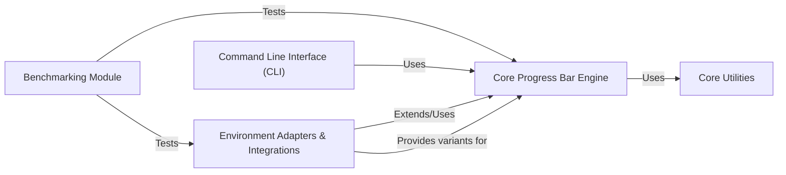

## Component Details

The `tqdm` project's architecture is elegantly designed around a central, highly extensible core, supported by a robust set of utilities and a modular system for adapting to diverse environments and integrating with various frameworks. The analysis reveals five fundamental components that collectively deliver `tqdm`'s powerful and versatile progress bar functionality.

### Core Progress Bar Engine
This is the heart of `tqdm`, encapsulating the fundamental logic for creating, updating, and displaying progress bars. It manages iteration state, calculates performance metrics (like elapsed time and iteration rate), handles dynamic console output, and provides flexible string formatting. It also includes internal mechanisms for managing multiple `tqdm` instances and ensuring synchronized, non-corrupted output, especially in concurrent environments.

**Related Classes/Methods**:

- <a href="https://github.com/tqdm/tqdm/blob/master/tqdm/std.py#L1-L1" target="_blank" rel="noopener noreferrer">`tqdm.std` (1:1)</a>
- <a href="https://github.com/tqdm/tqdm/blob/master/tqdm/_monitor.py#L1-L1" target="_blank" rel="noopener noreferrer">`tqdm._monitor` (1:1)</a>

### Core Utilities
This component provides essential helper classes and functions that support the `Core Progress Bar Engine`. It includes robust I/O handling mechanisms (e.g., `SimpleTextIOWrapper`, `DisableOnWriteError`) to ensure reliable output even with problematic file objects, and functions for detecting terminal characteristics (like width and Unicode support) crucial for cross-platform compatibility and stable display.

**Related Classes/Methods**:

- <a href="https://github.com/tqdm/tqdm/blob/master/tqdm/utils.py#L1-L1" target="_blank" rel="noopener noreferrer">`tqdm.utils` (1:1)</a>

### Environment Adapters & Integrations
This comprehensive component is responsible for adapting `tqdm`'s core functionality to various execution environments and integrating it seamlessly with external Python frameworks and libraries. It includes an intelligent auto-detection mechanism (`tqdm.auto`) that automatically selects the most appropriate `tqdm` implementation (e.g., for Jupyter Notebooks, `rich` terminals, `asyncio` operations, Keras training, Pandas data processing, or external messaging platforms), abstracting environment-specific complexities from the user.

**Related Classes/Methods**:

- <a href="https://github.com/tqdm/tqdm/blob/master/tqdm/auto.py#L1-L1" target="_blank" rel="noopener noreferrer">`tqdm.auto` (1:1)</a>
- <a href="https://github.com/tqdm/tqdm/blob/master/tqdm/notebook.py#L1-L1" target="_blank" rel="noopener noreferrer">`tqdm.notebook` (1:1)</a>
- <a href="https://github.com/tqdm/tqdm/blob/master/tqdm/rich.py#L1-L1" target="_blank" rel="noopener noreferrer">`tqdm.rich` (1:1)</a>
- <a href="https://github.com/tqdm/tqdm/blob/master/tqdm/asyncio.py#L1-L1" target="_blank" rel="noopener noreferrer">`tqdm.asyncio` (1:1)</a>
- <a href="https://github.com/tqdm/tqdm/blob/master/tqdm/keras.py#L1-L1" target="_blank" rel="noopener noreferrer">`tqdm.keras` (1:1)</a>
- <a href="https://github.com/tqdm/tqdm/blob/master/tqdm/_tqdm_pandas.py#L1-L1" target="_blank" rel="noopener noreferrer">`tqdm._tqdm_pandas` (1:1)</a>
- `tqdm.contrib` (1:1)

### Command Line Interface (CLI)
This component provides a standalone command-line utility for `tqdm`. It allows users to pipe input from other shell commands and display a `tqdm` progress bar directly in the terminal, enabling progress monitoring for non-Python processes or scripts without requiring explicit Python code.

**Related Classes/Methods**:

- <a href="https://github.com/tqdm/tqdm/blob/master/tqdm/cli.py#L1-L1" target="_blank" rel="noopener noreferrer">`tqdm.cli` (1:1)</a>

### Benchmarking Module
This component provides a dedicated framework for evaluating and comparing the performance of `tqdm` against other progress bar libraries. It is crucial for ensuring `tqdm` maintains its efficiency, responsiveness, and low overhead across different scenarios and with various integrations.

**Related Classes/Methods**:

- <a href="https://github.com/tqdm/tqdm/blob/master/benchmarks/benchmarks.py#L1-L1" target="_blank" rel="noopener noreferrer">`benchmarks.benchmarks` (1:1)</a>

### [FAQ](https://github.com/CodeBoarding/GeneratedOnBoardings/tree/main?tab=readme-ov-file#faq)