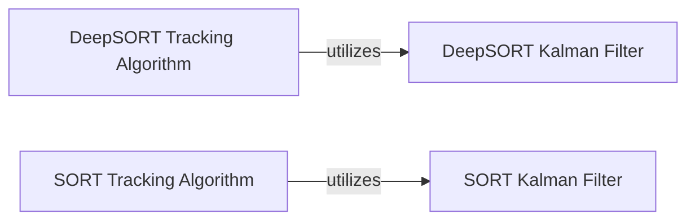

## Details

The tracking subsystem is composed of two main algorithms: DeepSORT and SORT, each with its specialized Kalman Filter implementation. The `DeepSORT Tracking Algorithm` orchestrates the tracking process by integrating object detections, extracting appearance features, and performing sophisticated data association that combines both motion and appearance cues. It relies heavily on the `DeepSORT Kalman Filter` for precise state estimation and prediction of individual object tracks, which also manages appearance features. In contrast, the `SORT Tracking Algorithm` provides a simpler, faster tracking solution. It focuses on motion-based data association using Intersection Over Union (IOU) and leverages the `SORT Kalman Filter` for efficient state estimation without incorporating appearance information. Both tracking algorithms are responsible for managing the lifecycle of their respective Kalman filter instances, including prediction, update, and track management (spawning new tracks and removing lost ones).

### DeepSORT Kalman Filter
A concrete implementation of the Kalman filter specifically tailored for the DeepSORT tracking algorithm. It manages the state vector (position, velocity) and covariance matrix, handling the prediction and update steps based on DeepSORT's requirements for robust identity management, including the management of appearance features.

**Related Classes/Methods**:

- <a href="https://github.com/roboflow/trackers/blob/main/trackers/core/deepsort/kalman_box_tracker.py#L6-L170" target="_blank" rel="noopener noreferrer">`trackers.core.deepsort.kalman_box_tracker.DeepSORTKalmanBoxTracker`:6-170</a>

### SORT Kalman Filter
A concrete implementation of the Kalman filter designed for the SORT (Simple Online and Realtime Tracking) algorithm. It handles the state estimation and prediction for object tracks with a simpler motion model, focusing on speed and efficiency without incorporating appearance features.

**Related Classes/Methods**:

- <a href="https://github.com/roboflow/trackers/blob/main/trackers/core/sort/kalman_box_tracker.py#L5-L139" target="_blank" rel="noopener noreferrer">`trackers.core.sort.kalman_box_tracker.SORTKalmanBoxTracker`:5-139</a>

### DeepSORT Tracking Algorithm
The primary DeepSORT algorithm orchestrator. It integrates object detections, extracts appearance features using a Re-ID model, performs data association by combining motion (IOU) and appearance distances, and utilizes the `DeepSORT Kalman Filter` for state estimation and track management.

**Related Classes/Methods**:

- <a href="https://github.com/roboflow/trackers/blob/main/trackers/core/deepsort/tracker.py#L17-L296" target="_blank" rel="noopener noreferrer">`trackers.core.deepsort.tracker.DeepSORTTracker`:17-296</a>

### SORT Tracking Algorithm
The primary SORT algorithm orchestrator. It integrates object detections, performs data association based solely on Intersection Over Union (IOU), and leverages the `SORT Kalman Filter` for efficient state estimation and track management.

**Related Classes/Methods**:

- <a href="https://github.com/roboflow/trackers/blob/main/trackers/core/sort/tracker.py#L14-L185" target="_blank" rel="noopener noreferrer">`trackers.core.sort.tracker.SORTTracker`:14-185</a>

### [FAQ](https://github.com/CodeBoarding/GeneratedOnBoardings/tree/main?tab=readme-ov-file#faq)