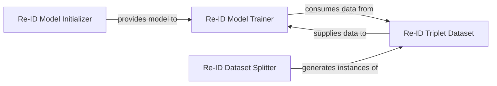

## Details

The Re-Identification Subsystem is a critical part of the trackers project, specifically designed for learning and providing unique appearance features for robust re-identification within the context of multi-object tracking. It encapsulates the neural network model for appearance embedding extraction and its entire training pipeline, including data handling.

### Re-ID Model Initializer
This component is responsible for the instantiation and initial setup of the re-identification neural network model. It handles both creating a new model from the timm library and loading pre-trained weights from a checkpoint.

**Related Classes/Methods**:

- <a href="https://github.com/roboflow/trackers/blob/main/trackers/core/reid/model.py" target="_blank" rel="noopener noreferrer">`trackers.core.reid.model:from_timm`</a>
- <a href="https://github.com/roboflow/trackers/blob/main/trackers/core/reid/model.py" target="_blank" rel="noopener noreferrer">`trackers.core.reid.model:_initialize_reid_model_from_timm`</a>
- <a href="https://github.com/roboflow/trackers/blob/main/trackers/core/reid/model.py" target="_blank" rel="noopener noreferrer">`trackers.core.reid.model:_initialize_reid_model_from_checkpoint`</a>

### Re-ID Model Trainer
This component orchestrates the entire training and validation pipeline for the re-identification model. It manages the forward and backward passes, loss calculation, optimization, and model adjustments based on training and validation steps. It also handles the addition of projection layers.

**Related Classes/Methods**:

- <a href="https://github.com/roboflow/trackers/blob/main/trackers/core/reid/model.py" target="_blank" rel="noopener noreferrer">`trackers.core.reid.model:train`</a>
- <a href="https://github.com/roboflow/trackers/blob/main/trackers/core/reid/model.py" target="_blank" rel="noopener noreferrer">`trackers.core.reid.model:_train_step`</a>
- <a href="https://github.com/roboflow/trackers/blob/main/trackers/core/reid/model.py" target="_blank" rel="noopener noreferrer">`trackers.core.reid.model:_validation_step`</a>
- <a href="https://github.com/roboflow/trackers/blob/main/trackers/core/reid/model.py" target="_blank" rel="noopener noreferrer">`trackers.core.reid.model:_add_projection_layer`</a>

### Re-ID Triplet Dataset
This component manages the data pipeline specifically for re-identification, focusing on loading images, applying necessary transformations, and generating triplet samples (anchor, positive, negative) essential for metric learning-based re-identification training.

**Related Classes/Methods**:

- <a href="https://github.com/roboflow/trackers/blob/main/trackers/core/reid/dataset/base.py" target="_blank" rel="noopener noreferrer">`trackers.core.reid.dataset.base:TripletsDataset`</a>
- <a href="https://github.com/roboflow/trackers/blob/main/trackers/core/reid/dataset/base.py" target="_blank" rel="noopener noreferrer">`trackers.core.reid.dataset.base:__getitem__`</a>
- <a href="https://github.com/roboflow/trackers/blob/main/trackers/core/reid/dataset/base.py" target="_blank" rel="noopener noreferrer">`trackers.core.reid.dataset.base:_load_and_transform_image`</a>
- <a href="https://github.com/roboflow/trackers/blob/main/trackers/core/reid/dataset/base.py" target="_blank" rel="noopener noreferrer">`trackers.core.reid.dataset.base:_get_triplet_image_paths`</a>

### Re-ID Dataset Splitter
This utility component is responsible for dividing a larger dataset into distinct training and validation subsets. It ensures proper data separation, which is critical for unbiased model evaluation.

**Related Classes/Methods**:

- <a href="https://github.com/roboflow/trackers/blob/main/trackers/core/reid/dataset/base.py" target="_blank" rel="noopener noreferrer">`trackers.core.reid.dataset.base:split`</a>

### [FAQ](https://github.com/CodeBoarding/GeneratedOnBoardings/tree/main?tab=readme-ov-file#faq)