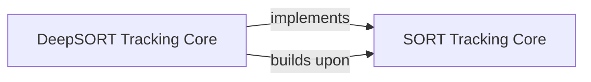

## Details

The tracking subsystem is primarily driven by the `DeepSORT Tracking Core`, which serves as the central component for robust object tracking. It encapsulates and directly implements the foundational motion-based tracking principles, conceptually referred to as `SORT Tracking Core`, by leveraging a Kalman filter for motion prediction and IoU-based association. Crucially, the `DeepSORT Tracking Core` enhances this foundation by integrating appearance features, enabling robust re-identification of objects across frames, especially after occlusions. Its main operational flow involves processing incoming detections via its `update` method, performing sophisticated association using a combined motion and appearance distance metric, and dynamically managing the lifecycle of object tracks, including the initialization of new tracks and the termination of lost ones.

### SORT Tracking Core
Represents the foundational motion-based tracking logic, including Kalman filtering for prediction, IoU-based association, and basic track management (initialization, update). While not a physically separate component, its principles and algorithms are directly integrated and form the core of the `DeepSORT Tracking Core`'s implementation.

**Related Classes/Methods**:

- <a href="https://github.com/roboflow/trackers/blob/main/trackers/core/base.py#L18-L20" target="_blank" rel="noopener noreferrer">`update`:18-20</a>
- <a href="https://github.com/roboflow/trackers/blob/main/trackers/core/deepsort/tracker.py#L134-L180" target="_blank" rel="noopener noreferrer">`_get_associated_indices`:134-180</a>
- <a href="https://github.com/roboflow/trackers/blob/main/trackers/core/deepsort/tracker.py#L182-L215" target="_blank" rel="noopener noreferrer">`_spawn_new_trackers`:182-215</a>

### DeepSORT Tracking Core
Implements the DeepSORT algorithm, which concretely extends and incorporates the conceptual `SORT Tracking Core` by integrating appearance features for robust re-identification. This component manages track lifecycles using a combined distance metric (motion and appearance), performs appearance-based re-identification, and maintains an appearance feature gallery for each track. It directly implements and builds upon the motion-based tracking functionalities.

**Related Classes/Methods**:

- <a href="https://github.com/roboflow/trackers/blob/main/trackers/core/base.py#L18-L20" target="_blank" rel="noopener noreferrer">`update`:18-20</a>
- <a href="https://github.com/roboflow/trackers/blob/main/trackers/core/deepsort/tracker.py#L134-L180" target="_blank" rel="noopener noreferrer">`_get_associated_indices`:134-180</a>
- <a href="https://github.com/roboflow/trackers/blob/main/trackers/core/deepsort/tracker.py#L104-L132" target="_blank" rel="noopener noreferrer">`_get_combined_distance_matrix`:104-132</a>
- <a href="https://github.com/roboflow/trackers/blob/main/trackers/core/deepsort/tracker.py#L79-L102" target="_blank" rel="noopener noreferrer">`_get_appearance_distance_matrix`:79-102</a>
- <a href="https://github.com/roboflow/trackers/blob/main/trackers/core/deepsort/tracker.py#L182-L215" target="_blank" rel="noopener noreferrer">`_spawn_new_trackers`:182-215</a>

### [FAQ](https://github.com/CodeBoarding/GeneratedOnBoardings/tree/main?tab=readme-ov-file#faq)