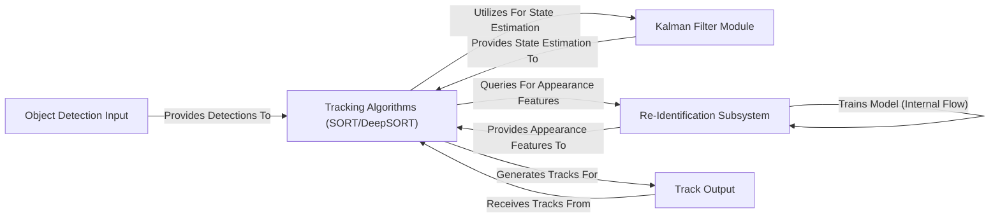

## Details

The `trackers` project implements a modular object tracking system, primarily leveraging SORT and DeepSORT algorithms. The system begins with an `Object Detection Input` component, which standardizes raw detection data from external frameworks. This data is then fed into the `Tracking Algorithms (SORT/DeepSORT)` component, the core of the system, responsible for maintaining object identities across frames. These algorithms heavily rely on the `Kalman Filter Module` for motion-based state estimation and, in the case of DeepSORT, integrate with the `Re-Identification Subsystem` for appearance-based re-association. The final processed tracking data is then exposed through the `Track Output` component, ready for downstream applications. This design emphasizes clear component boundaries and data flow, facilitating both documentation and visual diagram generation.

### Object Detection Input
The entry point for raw object detection data (e.g., bounding boxes, confidence scores, class IDs) into the tracking pipeline. This component represents the interface with external detection frameworks (e.g., `ultralytics`, `inference`), consuming a standardized `sv.Detections` object.

**Related Classes/Methods**:

- <a href="https://github.com/roboflow/trackers/blob/main/trackers/core/sort/tracker.py#L119-L177" target="_blank" rel="noopener noreferrer">`trackers.core.sort.tracker.update`:119-177</a>
- <a href="https://github.com/roboflow/trackers/blob/main/trackers/core/deepsort/tracker.py#L217-L288" target="_blank" rel="noopener noreferrer">`trackers.core.deepsort.tracker.update`:217-288</a>

### Tracking Algorithms (SORT/DeepSORT) [[Expand]](./Tracking_Algorithms_SORT_DeepSORT_.md)
This logical grouping encompasses both the `SORT Tracking Core` and `DeepSORT Tracking Core`. These are the primary algorithms responsible for maintaining object tracks. SORT uses motion-based prediction, while DeepSORT extends this with appearance features for robust re-identification.

**Related Classes/Methods**:

- <a href="https://github.com/roboflow/trackers/blob/main/trackers/core/sort/tracker.py#L119-L177" target="_blank" rel="noopener noreferrer">`trackers.core.sort.tracker.update`:119-177</a>
- <a href="https://github.com/roboflow/trackers/blob/main/trackers/core/sort/tracker.py#L61-L92" target="_blank" rel="noopener noreferrer">`trackers.core.sort.tracker._get_associated_indices`:61-92</a>
- <a href="https://github.com/roboflow/trackers/blob/main/trackers/core/sort/tracker.py#L94-L117" target="_blank" rel="noopener noreferrer">`trackers.core.sort.tracker._spawn_new_trackers`:94-117</a>
- <a href="https://github.com/roboflow/trackers/blob/main/trackers/core/deepsort/tracker.py#L217-L288" target="_blank" rel="noopener noreferrer">`trackers.core.deepsort.tracker.update`:217-288</a>
- <a href="https://github.com/roboflow/trackers/blob/main/trackers/core/deepsort/tracker.py#L134-L180" target="_blank" rel="noopener noreferrer">`trackers.core.deepsort.tracker._get_associated_indices`:134-180</a>
- <a href="https://github.com/roboflow/trackers/blob/main/trackers/core/deepsort/tracker.py#L104-L132" target="_blank" rel="noopener noreferrer">`trackers.core.deepsort.tracker._get_combined_distance_matrix`:104-132</a>
- <a href="https://github.com/roboflow/trackers/blob/main/trackers/core/deepsort/tracker.py#L79-L102" target="_blank" rel="noopener noreferrer">`trackers.core.deepsort.tracker._get_appearance_distance_matrix`:79-102</a>
- <a href="https://github.com/roboflow/trackers/blob/main/trackers/core/deepsort/tracker.py#L182-L215" target="_blank" rel="noopener noreferrer">`trackers.core.deepsort.tracker._spawn_new_trackers`:182-215</a>

### Kalman Filter Module [[Expand]](./Kalman_Filter_Module.md)
A shared utility component providing state estimation and prediction capabilities for object tracks. It's used by both SORT and DeepSORT to predict object positions and manage track states over time, forming the core of motion-based tracking.

**Related Classes/Methods**:

- <a href="https://github.com/roboflow/trackers/blob/main/trackers/core/deepsort/kalman_box_tracker.py#L46-L74" target="_blank" rel="noopener noreferrer">`trackers.core.deepsort.kalman_box_tracker.__init__`:46-74</a>
- <a href="https://github.com/roboflow/trackers/blob/main/trackers/core/sort/kalman_box_tracker.py#L42-L66" target="_blank" rel="noopener noreferrer">`trackers.core.sort.kalman_box_tracker.__init__`:42-66</a>

### Re-Identification Subsystem [[Expand]](./Re_Identification_Subsystem.md)
This component encapsulates the neural network model for appearance embedding extraction and its entire training pipeline, including data handling. It's responsible for learning and providing unique appearance features for robust re-identification.

**Related Classes/Methods**:

- <a href="https://github.com/roboflow/trackers/blob/main/trackers/core/reid/model.py#L121-L157" target="_blank" rel="noopener noreferrer">`trackers.core.reid.model.from_timm`:121-157</a>
- <a href="https://github.com/roboflow/trackers/blob/main/trackers/core/reid/model.py#L32-L67" target="_blank" rel="noopener noreferrer">`trackers.core.reid.model._initialize_reid_model_from_timm`:32-67</a>
- <a href="https://github.com/roboflow/trackers/blob/main/trackers/core/reid/model.py#L70-L82" target="_blank" rel="noopener noreferrer">`trackers.core.reid.model._initialize_reid_model_from_checkpoint`:70-82</a>
- <a href="https://github.com/roboflow/trackers/blob/main/trackers/core/reid/model.py#L300-L549" target="_blank" rel="noopener noreferrer">`trackers.core.reid.model.train`:300-549</a>
- <a href="https://github.com/roboflow/trackers/blob/main/trackers/core/reid/model.py#L216-L257" target="_blank" rel="noopener noreferrer">`trackers.core.reid.model._train_step`:216-257</a>
- <a href="https://github.com/roboflow/trackers/blob/main/trackers/core/reid/model.py#L259-L298" target="_blank" rel="noopener noreferrer">`trackers.core.reid.model._validation_step`:259-298</a>
- <a href="https://github.com/roboflow/trackers/blob/main/trackers/core/reid/model.py#L190-L214" target="_blank" rel="noopener noreferrer">`trackers.core.reid.model._add_projection_layer`:190-214</a>
- <a href="https://github.com/roboflow/trackers/blob/main/trackers/core/reid/dataset/base.py#L118-L146" target="_blank" rel="noopener noreferrer">`trackers.core.reid.dataset.base.__getitem__`:118-146</a>
- <a href="https://github.com/roboflow/trackers/blob/main/trackers/core/reid/dataset/base.py#L96-L100" target="_blank" rel="noopener noreferrer">`trackers.core.reid.dataset.base._load_and_transform_image`:96-100</a>
- <a href="https://github.com/roboflow/trackers/blob/main/trackers/core/reid/dataset/base.py#L102-L116" target="_blank" rel="noopener noreferrer">`trackers.core.reid.dataset.base._get_triplet_image_paths`:102-116</a>
- <a href="https://github.com/roboflow/trackers/blob/main/trackers/core/reid/dataset/base.py#L148-L171" target="_blank" rel="noopener noreferrer">`trackers.core.reid.dataset.base.split`:148-171</a>
- <a href="https://github.com/roboflow/trackers/blob/main/trackers/core/reid/dataset/base.py#L16-L171" target="_blank" rel="noopener noreferrer">`trackers.core.reid.dataset.base.TripletsDataset`:16-171</a>

### Track Output
Represents the final output of the tracking system. This typically includes a stream of tracked objects with their unique IDs, bounding box coordinates, and potentially other attributes, ready for visualization, logging, or further integration into downstream applications. The output is a `sv.Detections` object augmented with `tracker_id`.

**Related Classes/Methods**:

- <a href="https://github.com/roboflow/trackers/blob/main/trackers/core/sort/tracker.py#L119-L177" target="_blank" rel="noopener noreferrer">`trackers.core.sort.tracker.update`:119-177</a>
- <a href="https://github.com/roboflow/trackers/blob/main/trackers/core/deepsort/tracker.py#L217-L288" target="_blank" rel="noopener noreferrer">`trackers.core.deepsort.tracker.update`:217-288</a>

### [FAQ](https://github.com/CodeBoarding/GeneratedOnBoardings/tree/main?tab=readme-ov-file#faq)