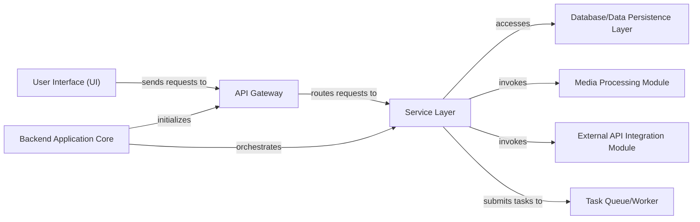

## Details

One paragraph explaining the functionality which is represented by this graph. What the main flow is and what is its purpose.

### User Interface (UI)
The client-side application responsible for user interaction, displaying media information, and initiating requests to the backend API.

**Related Classes/Methods**: _None_

### API Gateway [[Expand]](./API_Gateway.md)
Serves as the primary entry point for all client requests, handling HTTP request parsing, validation, and routing to appropriate backend services. It orchestrates responses back to the client.

**Related Classes/Methods**:

- `backend.api.v1.routes`

### Backend Application Core
The main FastAPI application instance responsible for initializing the API, configuring middleware, and orchestrating the various backend modules and services.

**Related Classes/Methods**:

- `backend.main`

### Service Layer
Encapsulates the core business logic of the application, processing requests received from the API Gateway, interacting with data persistence, and coordinating with other backend modules like media processing and external integrations.

**Related Classes/Methods**:

- `backend.core.services`

### Media Processing Module
Handles operations related to media manipulation, such as video conversion, metadata extraction, and file management, utilizing tools like Ffmpeg and Yt-dlp.

**Related Classes/Methods**:

- `backend.core.tasks.media_tasks`

### External API Integration Module
Manages communication with external media management systems like Radarr and Sonarr, handling API calls, data synchronization, and status updates.

**Related Classes/Methods**:

- `backend.core.base.arr_manager`

### Database/Data Persistence Layer
Responsible for storing and retrieving application data, including user profiles, media metadata, and configuration settings, using a database (e.g., SQLite, PostgreSQL) and managed by Alembic.

**Related Classes/Methods**:

- `backend.core.base.database`
- `backend.alembic`

### Task Queue/Worker
Manages and executes asynchronous, long-running tasks (e.g., media processing, large data imports) in the background, preventing blocking of the main API thread.

**Related Classes/Methods**:

- `backend.core.tasks`
- `backend.api.v1.tasks`

### [FAQ](https://github.com/CodeBoarding/GeneratedOnBoardings/tree/main?tab=readme-ov-file#faq)