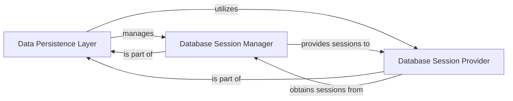

## Details

One paragraph explaining the functionality which is represented by this graph. What the main flow is and what is its purpose.

### Data Persistence Layer [[Expand]](./Data_Persistence_Layer.md)
Serves as the primary interface for all database operations, abstracting the underlying database implementation. It manages the persistence and retrieval of both media entities and connection-related configurations. This layer provides a unified interface for all database interactions, abstracting the underlying database technology. It is responsible for managing the lifecycle of database connections and sessions, facilitating the persistence and retrieval of application data, including media entities and configuration settings. It ensures data integrity and consistency across the application.

**Related Classes/Methods**:

- `backend.core.base.database.utils.engine.engine`
- <a href="https://github.com/nandyalu/trailarr/blob/main/backend/core/base/database/utils/engine.py#L36-L47" target="_blank" rel="noopener noreferrer">`backend.core.base.database.utils.engine.set_sqlite_pragma` (36:47)</a>

### Database Session Manager
Manages the lifecycle of database sessions, including their creation, pooling, and proper closure. It ensures efficient and safe concurrent access to the database resources.

**Related Classes/Methods**:

- <a href="https://github.com/nandyalu/trailarr/blob/main/backend/core/base/database/utils/engine.py#L78-L135" target="_blank" rel="noopener noreferrer">`backend.core.base.database.utils.engine.manage_session` (78:135)</a>

### Database Session Provider
Provides database sessions to various parts of the application, acting as a central point for obtaining active database connections. It abstracts the session management details from the consumers.

**Related Classes/Methods**:

- <a href="https://github.com/nandyalu/trailarr/blob/main/backend/core/base/database/utils/engine.py#L58-L75" target="_blank" rel="noopener noreferrer">`backend.core.base.database.utils.engine.get_session` (58:75)</a>

### [FAQ](https://github.com/CodeBoarding/GeneratedOnBoardings/tree/main?tab=readme-ov-file#faq)