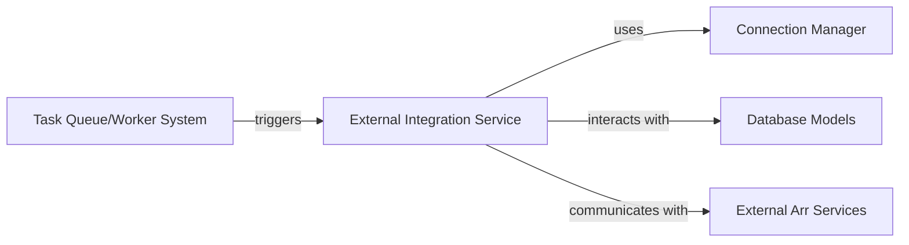

## Details

One paragraph explaining the functionality which is represented by this graph. What the main flow is and what is its purpose.

### External Integration Service [[Expand]](./External_Integration_Service.md)
Manages all asynchronous communication and requests to external "Arr" services (e.g., Radarr, Sonarr). It is responsible for orchestrating API calls, sending requests, processing responses, and updating internal media status based on these interactions. This component acts as the primary interface for the application to interact with external media management systems.

**Related Classes/Methods**:

- `backend.core.tasks.schedules`
- <a href="https://github.com/nandyalu/trailarr/blob/main/backend/core/base/connection_manager.py#L14-L33" target="_blank" rel="noopener noreferrer">`backend.core.base.connection_manager.ArrManagerProtocol` (14:33)</a>
- <a href="https://github.com/nandyalu/trailarr/blob/main/backend/core/base/connection_manager.py#L36-L397" target="_blank" rel="noopener noreferrer">`backend.core.base.connection_manager.BaseConnectionManager` (36:397)</a>
- <a href="https://github.com/nandyalu/trailarr/blob/main/backend/core/base/database/models/connection.py#L66-L75" target="_blank" rel="noopener noreferrer">`backend.core.base.database.models.connection.Connection` (66:75)</a>
- <a href="https://github.com/nandyalu/trailarr/blob/main/backend/core/base/database/models/media.py#L90-L106" target="_blank" rel="noopener noreferrer">`backend.core.base.database.models.media.Media` (90:106)</a>

### Connection Manager
Provides an abstraction layer for managing connections to various external 'Arr' services. It handles the details of establishing, maintaining, and retrieving connection configurations, ensuring that the External Integration Service can interact with different 'Arr' instances seamlessly.

**Related Classes/Methods**:

- <a href="https://github.com/nandyalu/trailarr/blob/main/backend/core/base/connection_manager.py#L14-L33" target="_blank" rel="noopener noreferrer">`backend.core.base.connection_manager.ArrManagerProtocol` (14:33)</a>
- <a href="https://github.com/nandyalu/trailarr/blob/main/backend/core/base/connection_manager.py#L36-L397" target="_blank" rel="noopener noreferrer">`backend.core.base.connection_manager.BaseConnectionManager` (36:397)</a>

### Database Models
Defines the data structures and schema for persisting information related to external 'Arr' service connections and the internal media status. These models are crucial for storing configuration details and tracking the state of media items managed through the integration.

**Related Classes/Methods**:

- <a href="https://github.com/nandyalu/trailarr/blob/main/backend/core/base/database/models/connection.py#L66-L75" target="_blank" rel="noopener noreferrer">`backend.core.base.database.models.connection.Connection` (66:75)</a>
- <a href="https://github.com/nandyalu/trailarr/blob/main/backend/core/base/database/models/connection.py#L78-L81" target="_blank" rel="noopener noreferrer">`backend.core.base.database.models.connection.ConnectionCreate` (78:81)</a>
- <a href="https://github.com/nandyalu/trailarr/blob/main/backend/core/base/database/models/connection.py#L84-L89" target="_blank" rel="noopener noreferrer">`backend.core.base.database.models.connection.ConnectionRead` (84:89)</a>
- <a href="https://github.com/nandyalu/trailarr/blob/main/backend/core/base/database/models/connection.py#L12-L14" target="_blank" rel="noopener noreferrer">`backend.core.base.database.models.connection.ArrType` (12:14)</a>
- <a href="https://github.com/nandyalu/trailarr/blob/main/backend/core/base/database/models/connection.py#L17-L22" target="_blank" rel="noopener noreferrer">`backend.core.base.database.models.connection.MonitorType` (17:22)</a>
- <a href="https://github.com/nandyalu/trailarr/blob/main/backend/core/base/database/models/media.py#L90-L106" target="_blank" rel="noopener noreferrer">`backend.core.base.database.models.media.Media` (90:106)</a>
- <a href="https://github.com/nandyalu/trailarr/blob/main/backend/core/base/database/models/media.py#L109-L122" target="_blank" rel="noopener noreferrer">`backend.core.base.database.models.media.MediaCreate` (109:122)</a>
- <a href="https://github.com/nandyalu/trailarr/blob/main/backend/core/base/database/models/media.py#L125-L131" target="_blank" rel="noopener noreferrer">`backend.core.base.database.models.media.MediaRead` (125:131)</a>
- <a href="https://github.com/nandyalu/trailarr/blob/main/backend/core/base/database/models/media.py#L134-L152" target="_blank" rel="noopener noreferrer">`backend.core.base.database.models.media.MediaUpdate` (134:152)</a>
- <a href="https://github.com/nandyalu/trailarr/blob/main/backend/core/base/database/models/media.py#L16-L22" target="_blank" rel="noopener noreferrer">`backend.core.base.database.models.media.MonitorStatus` (16:22)</a>

### Task Queue/Worker System
Responsible for scheduling and executing asynchronous operations, including the periodic or event-driven tasks that trigger the External Integration Service. This system ensures that external API calls and status updates do not block the main application flow.

**Related Classes/Methods**:

- `backend.core.tasks.schedules`

### External Arr Services
Represents the external Radarr and Sonarr services that the application integrates with. These are third-party systems providing media management functionalities, which the External Integration Service communicates with via their respective APIs.

**Related Classes/Methods**: _None_

### [FAQ](https://github.com/CodeBoarding/GeneratedOnBoardings/tree/main?tab=readme-ov-file#faq)