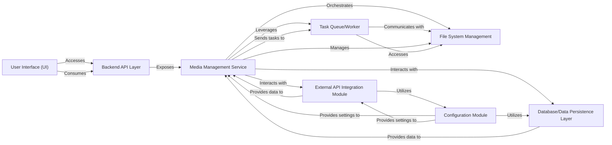

## Details

One paragraph explaining the functionality which is represented by this graph. What the main flow is and what is its purpose.

### Media Management Service [[Expand]](./Media_Management_Service.md)
Encapsulates the core business rules and operations related to media entities. This includes the logic for creating, updating, searching media records, and orchestrating interactions with the file system for media organization and processing.

**Related Classes/Methods**:

- `backend/core/tasks.py` (1:1)
- <a href="https://github.com/nandyalu/trailarr/blob/main/backend/core/base/database/models/media.py#L90-L106" target="_blank" rel="noopener noreferrer">`backend/core/base/database/models/media.Media` (90:106)</a>

### Backend API Layer
Provides a RESTful interface for the frontend and other clients to interact with the backend services, handling request routing, validation, and serialization.

**Related Classes/Methods**:

- <a href="https://github.com/nandyalu/trailarr/blob/main/backend/api/v1/routes.py#L1-L1" target="_blank" rel="noopener noreferrer">`backend/api/v1/routes.py` (1:1)</a>

### Database/Data Persistence Layer
Manages the storage, retrieval, and integrity of application data, including media metadata, user profiles, and configuration settings. Utilizes a database (e.g., SQLite, PostgreSQL) with migration management.

**Related Classes/Methods**:

- `backend/core/base/database/models/*.py` (1:1)

### Task Queue/Worker
Executes long-running or asynchronous tasks, such as media transcoding, downloading, or large-scale file operations, offloading them from the main API thread to ensure responsiveness.

**Related Classes/Methods**:

- `backend/core/tasks.py` (1:1)

### External API Integration Module
Handles communication with third-party services like Radarr, Sonarr, yt-dlp, and ffmpeg for media acquisition, metadata enrichment, and processing.

**Related Classes/Methods**:

- <a href="https://github.com/nandyalu/trailarr/blob/main/backend/core/base/arr_manager/base.py#L1-L1" target="_blank" rel="noopener noreferrer">`backend/core/base/arr_manager/base.py` (1:1)</a>

### File System Management
Manages the physical storage and organization of media files on the server's file system, including creating directories, moving, and deleting files.

**Related Classes/Methods**:

- `backend/core/file_manager/manager.py` (1:1)

### User Interface (UI)
The client-side application providing the graphical user interface for users to interact with the media management system, focusing on UI/UX.

**Related Classes/Methods**: _None_

### Configuration Module
Centralizes and manages application-wide settings, environment variables, and external service credentials, ensuring flexible deployment and operation.

**Related Classes/Methods**:

- <a href="https://github.com/nandyalu/trailarr/blob/main/backend/config/settings.py#L1-L1" target="_blank" rel="noopener noreferrer">`backend/config/settings.py` (1:1)</a>

### [FAQ](https://github.com/CodeBoarding/GeneratedOnBoardings/tree/main?tab=readme-ov-file#faq)