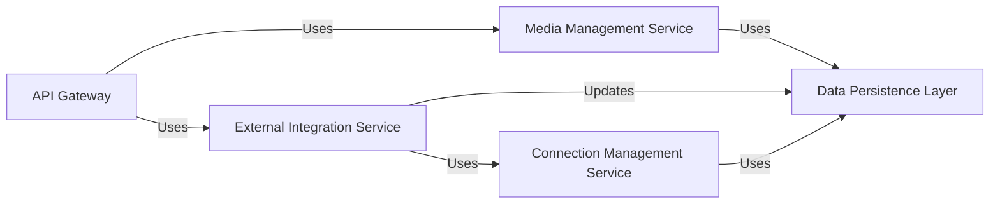

## Details

One paragraph explaining the functionality which is represented by this graph. What the main flow is and what is its purpose.

### API Gateway [[Expand]](./API_Gateway.md)
Serves as the primary entry point for all client requests, handling HTTP request parsing, validation, and routing to appropriate backend services. It orchestrates responses back to the client.

**Related Classes/Methods**:

- <a href="https://github.com/nandyalu/trailarr/blob/main/backend/api/v1/routes.py#L1-L1" target="_blank" rel="noopener noreferrer">`backend/api/v1/routes.py` (1:1)</a>

### Media Management Service [[Expand]](./Media_Management_Service.md)
Encapsulates the core business rules and operations related to media entities. This includes the logic for creating, updating, searching media records, and orchestrating interactions with the file system for media organization.

**Related Classes/Methods**:

- `backend/core/tasks.py` (1:1)

### External Integration Service [[Expand]](./External_Integration_Service.md)
Manages all asynchronous communication and requests to external "Arr" services (e.g., Radarr, Sonarr). It is responsible for orchestrating API calls, sending requests, processing responses, and updating internal media status based on these interactions.

**Related Classes/Methods**:

- <a href="https://github.com/nandyalu/trailarr/blob/main/backend/core/tasks/schedules.py#L1-L1" target="_blank" rel="noopener noreferrer">`backend/core/tasks/schedules.py` (1:1)</a>

### Connection Management Service
Provides a foundational layer for managing and establishing various types of connections, primarily for external services and internal configurations. It ensures that connection parameters are securely managed and accessible.

**Related Classes/Methods**:

- <a href="https://github.com/nandyalu/trailarr/blob/main/backend/config/settings.py#L1-L1" target="_blank" rel="noopener noreferrer">`backend/config/settings.py` (1:1)</a>

### Data Persistence Layer [[Expand]](./Data_Persistence_Layer.md)
Serves as the primary interface for all database operations, abstracting the underlying database implementation. It manages the persistence and retrieval of both media entities and connection-related configurations.

**Related Classes/Methods**:

- `backend/core/base/database/utils.py` (1:1)

### [FAQ](https://github.com/CodeBoarding/GeneratedOnBoardings/tree/main?tab=readme-ov-file#faq)