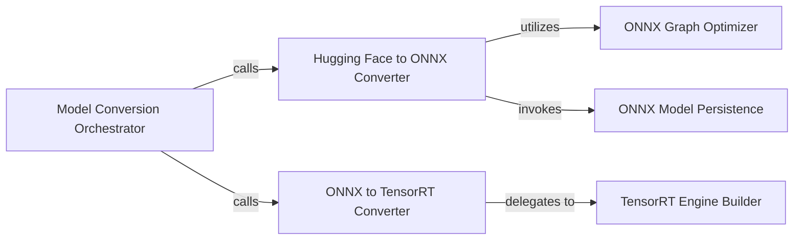

## Details

The Model Conversion & Optimization Orchestrator subsystem is primarily defined by the transformer_deploy.convert module, which orchestrates the end-to-end model transformation process, and its direct dependencies within transformer_deploy.backends.onnx_utils and transformer_deploy.backends.trt_utils that handle specific ONNX graph optimizations and TensorRT engine building.

### Model Conversion Orchestrator
Serves as the primary entry point and orchestrator for the entire model conversion and optimization pipeline. It coordinates the sequence of operations from Hugging Face model input to optimized TensorRT engine output.

**Related Classes/Methods**:

- <a href="https://github.com/ELS-RD/transformer-deploy/blob/main/src/transformer_deploy/convert.py#L100-L489" target="_blank" rel="noopener noreferrer">`transformer_deploy.convert.main`:100-489</a>

### Hugging Face to ONNX Converter
Converts Hugging Face models into the ONNX format, preparing them for further optimization and deployment. This is the initial transformation step in the pipeline.

**Related Classes/Methods**:

- <a href="https://github.com/ELS-RD/transformer-deploy/blob/main/src/transformer_deploy/convert.py" target="_blank" rel="noopener noreferrer">`transformer_deploy.convert.convert_hf_to_onnx`</a>

### ONNX to TensorRT Converter
Manages the conversion of optimized ONNX models into high-performance TensorRT engines, tailored for NVIDIA GPUs. This is the final stage of model transformation for deployment.

**Related Classes/Methods**:

- <a href="https://github.com/ELS-RD/transformer-deploy/blob/main/src/transformer_deploy/convert.py" target="_blank" rel="noopener noreferrer">`transformer_deploy.convert.convert_onnx_to_trt`</a>

### ONNX Graph Optimizer
Applies graph-level optimizations to ONNX models to improve inference efficiency and reduce latency. This component is key to the "Optimization" aspect of the subsystem.

**Related Classes/Methods**:

- <a href="https://github.com/ELS-RD/transformer-deploy/blob/main/src/transformer_deploy/backends/onnx_utils.py" target="_blank" rel="noopener noreferrer">`transformer_deploy.backends.onnx_utils`</a>

### ONNX Model Persistence
Handles the persistence of optimized ONNX models to disk, making them available for subsequent steps or deployment.

**Related Classes/Methods**:

- <a href="https://github.com/ELS-RD/transformer-deploy/blob/main/src/transformer_deploy/backends/onnx_utils.py" target="_blank" rel="noopener noreferrer">`transformer_deploy.backends.onnx_utils`</a>

### TensorRT Engine Builder
Compiles ONNX models into highly optimized TensorRT engines, considering specific hardware and input shapes for maximum performance.

**Related Classes/Methods**:

- <a href="https://github.com/ELS-RD/transformer-deploy/blob/main/src/transformer_deploy/backends/trt_utils.py" target="_blank" rel="noopener noreferrer">`transformer_deploy.backends.trt_utils`</a>

### [FAQ](https://github.com/CodeBoarding/GeneratedOnBoardings/tree/main?tab=readme-ov-file#faq)