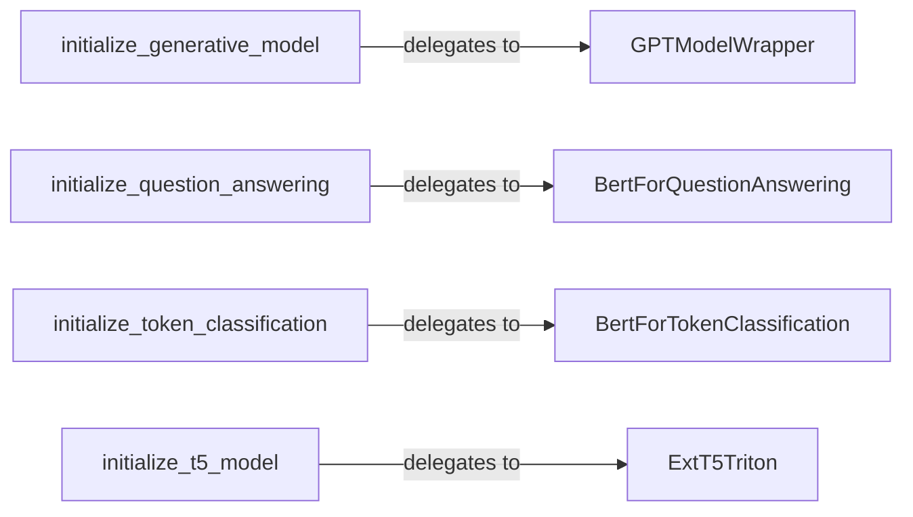

## Details

The `transformer-deploy` project facilitates the deployment of various Transformer models by providing specialized initialization and wrapping components for different model architectures and tasks. The core of the subsystem revolves around distinct initialization functions (`initialize_generative_model`, `initialize_question_answering`, `initialize_token_classification`, `initialize_t5_model`) that act as entry points for setting up specific model types. Each initialization function delegates to a corresponding model wrapper class (`GPTModelWrapper`, `BertForQuestionAnswering`, `BertForTokenClassification`, `ExtT5Triton`). These wrapper classes encapsulate the intricate logic for loading, configuring, and preparing the Transformer models, including handling tokenization, model architecture, and specific preprocessing steps tailored to their respective tasks (generative, question answering, token classification, or T5 with Triton integration). This modular design ensures clear separation of concerns, allowing for flexible and extensible deployment of diverse Transformer models.

### initialize_generative_model
Orchestrates the initial setup and loading process for generative Transformer models (e.g., GPT-like architectures). It serves as the primary entry point for initializing these models within the deployment pipeline.

**Related Classes/Methods**:

- <a href="https://github.com/ELS-RD/transformer-deploy/blob/main/src/transformer_deploy/utils/generative_model.py#L44-L61" target="_blank" rel="noopener noreferrer">`transformer_deploy.utils.generative_model.initialize_generative_model`:44-61</a>

### GPTModelWrapper
Encapsulates the specific logic for loading, configuring, and preparing GPT-like generative models from Hugging Face. This includes handling model architecture, tokenizer loading, and any specific preprocessing steps required for generative tasks.

**Related Classes/Methods**:

- <a href="https://github.com/ELS-RD/transformer-deploy/blob/main/src/transformer_deploy/utils/generative_model.py#L44-L61" target="_blank" rel="noopener noreferrer">`transformer_deploy.utils.generative_model.GPTModelWrapper`:44-61</a>

### initialize_question_answering
Orchestrates the initial setup and loading process for question answering Transformer models (e.g., BERT-based). It manages the entry point for preparing QA models.

**Related Classes/Methods**:

- <a href="https://github.com/ELS-RD/transformer-deploy/blob/main/src/transformer_deploy/utils/question_answering.py#L42-L78" target="_blank" rel="noopener noreferrer">`transformer_deploy.utils.question_answering.initialize_question_answering`:42-78</a>

### BertForQuestionAnswering
Encapsulates the logic for loading, configuring, and preparing BERT-based models specifically for question answering tasks. This involves handling the specific input/output formats and tokenization strategies for QA.

**Related Classes/Methods**:

- <a href="https://github.com/ELS-RD/transformer-deploy/blob/main/src/transformer_deploy/utils/question_answering.py#L42-L78" target="_blank" rel="noopener noreferrer">`transformer_deploy.utils.question_answering.BertForQuestionAnswering`:42-78</a>

### initialize_token_classification
Orchestrates the initial setup and loading process for token classification Transformer models (e.g., BERT-based for NER). It provides the entry point for preparing these models.

**Related Classes/Methods**:

- <a href="https://github.com/ELS-RD/transformer-deploy/blob/main/src/transformer_deploy/utils/token_classifier.py#L43-L75" target="_blank" rel="noopener noreferrer">`transformer_deploy.utils.token_classifier.initialize_token_classification`:43-75</a>

### BertForTokenClassification
Encapsulates the logic for loading, configuring, and preparing BERT-based models for token classification tasks (e.g., Named Entity Recognition). It handles the specific tokenization and output processing for these models.

**Related Classes/Methods**:

- <a href="https://github.com/ELS-RD/transformer-deploy/blob/main/src/transformer_deploy/utils/token_classifier.py#L43-L75" target="_blank" rel="noopener noreferrer">`transformer_deploy.utils.token_classifier.BertForTokenClassification`:43-75</a>

### initialize_t5_model
Orchestrates the initial setup and loading process for T5 Transformer models, particularly with considerations for Nvidia Triton Inference Server integration.

**Related Classes/Methods**:

- <a href="https://github.com/ELS-RD/transformer-deploy/blob/main/src/transformer_deploy/t5_utils/t5_model.py#L41-L274" target="_blank" rel="noopener noreferrer">`transformer_deploy.t5_utils.t5_model.initialize_t5_model`:41-274</a>

### ExtT5Triton
Encapsulates the logic for loading, configuring, and preparing T5 models, with specific extensions tailored for integration with the Nvidia Triton Inference Server. This suggests specialized handling for Triton's requirements, such as input/output tensor definitions.

**Related Classes/Methods**:

- <a href="https://github.com/ELS-RD/transformer-deploy/blob/main/src/transformer_deploy/t5_utils/t5_model.py#L41-L274" target="_blank" rel="noopener noreferrer">`transformer_deploy.t5_utils.t5_model.ExtT5Triton`:41-274</a>

### [FAQ](https://github.com/CodeBoarding/GeneratedOnBoardings/tree/main?tab=readme-ov-file#faq)