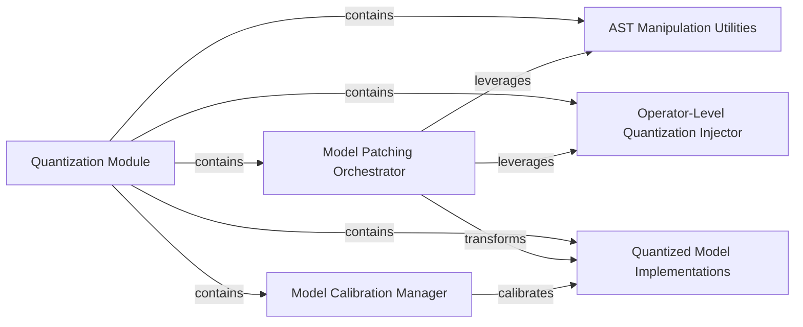

## Details

The `transformer_deploy.QDQModels` subsystem, acting as the **Quantization Module**, orchestrates the entire process of quantizing Transformer models. The core workflow begins with the **Model Patching Orchestrator**, which prepares models for quantization by leveraging **AST Manipulation Utilities** for structural changes and the **Operator-Level Quantization Injector** for fine-grained, operator-specific modifications. Once the model is transformed, the **Model Calibration Manager** steps in to perform NVIDIA Quantization Aware Training (QAT), ensuring the accuracy of the newly created **Quantized Model Implementations**. This structured approach ensures efficient and accurate model precision reduction, enhancing deployment performance.

### Quantization Module [[Expand]](./Quantization_Module.md)
The overarching module responsible for applying quantization techniques to reduce model precision and memory footprint, enhancing inference performance and efficiency. It orchestrates the entire quantization workflow.

**Related Classes/Methods**:

- <a href="https://github.com/ELS-RD/transformer-deploy/blob/main/src/transformer_deploy/QDQModels/__init__.py" target="_blank" rel="noopener noreferrer">`transformer_deploy.QDQModels`</a>

### Model Patching Orchestrator
Orchestrates the high-level patching of models to prepare them for quantization. It serves as the primary interface for initiating the model transformation process, coordinating AST manipulation and operator-level modifications.

**Related Classes/Methods**:

- <a href="https://github.com/ELS-RD/transformer-deploy/blob/main/src/transformer_deploy/QDQModels/patch.py" target="_blank" rel="noopener noreferrer">`transformer_deploy.QDQModels.patch`</a>

### AST Manipulation Utilities
Provides foundational utilities for Abstract Syntax Tree (AST) manipulation. This component is crucial for programmatically modifying the model's source representation to inject and manage quantization-related code.

**Related Classes/Methods**:

- <a href="https://github.com/ELS-RD/transformer-deploy/blob/main/src/transformer_deploy/QDQModels/ast_utils.py" target="_blank" rel="noopener noreferrer">`transformer_deploy.QDQModels.ast_utils`</a>

### Operator-Level Quantization Injector
Performs fine-grained, AST-level modifications to individual operators within the model. Its role is to integrate quantization logic directly into the model's computational graph at the operator level.

**Related Classes/Methods**:

- <a href="https://github.com/ELS-RD/transformer-deploy/blob/main/src/transformer_deploy/QDQModels/ast_operator_patch.py" target="_blank" rel="noopener noreferrer">`transformer_deploy.QDQModels.ast_operator_patch`</a>

### Model Calibration Manager
Manages the calibration process for quantized models. This involves setting up and finalizing NVIDIA Quantization Aware Training (QAT), a crucial step to ensure the accuracy of the quantized model after transformation.

**Related Classes/Methods**:

- <a href="https://github.com/ELS-RD/transformer-deploy/blob/main/src/transformer_deploy/QDQModels/calibration_utils.py" target="_blank" rel="noopener noreferrer">`transformer_deploy.QDQModels.calibration_utils`</a>

### Quantized Model Implementations
Represents specific quantized model implementations or configurations for various Transformer architectures (e.g., Albert, Bert, Deberta). These are the target models that undergo the quantization process.

**Related Classes/Methods**:

- <a href="https://github.com/ELS-RD/transformer-deploy/blob/main/src/transformer_deploy/QDQModels/QDQAlbert.py" target="_blank" rel="noopener noreferrer">`transformer_deploy.QDQModels.QDQAlbert`</a>
- <a href="https://github.com/ELS-RD/transformer-deploy/blob/main/src/transformer_deploy/QDQModels/QDQBert.py" target="_blank" rel="noopener noreferrer">`transformer_deploy.QDQModels.QDQBert`</a>

### [FAQ](https://github.com/CodeBoarding/GeneratedOnBoardings/tree/main?tab=readme-ov-file#faq)