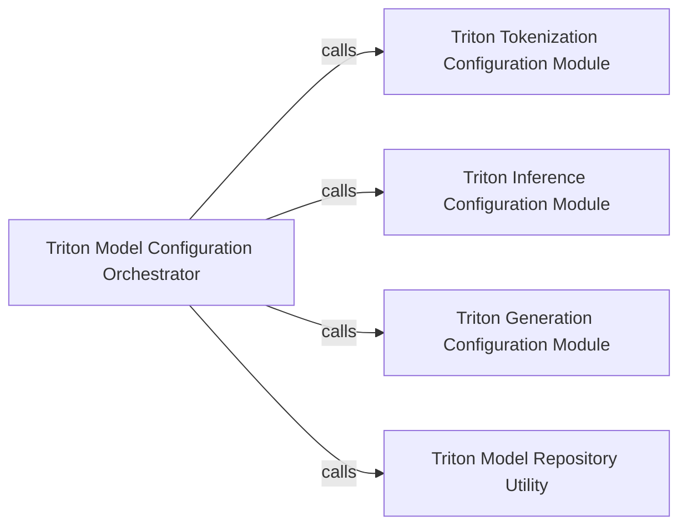

## Details

The Triton Inference Server Configuration Generator subsystem is responsible for automating the creation of configuration files for deploying various transformer models on NVIDIA Triton Inference Server. This subsystem ensures that models are correctly loaded and executed by Triton, adhering to specific requirements for different model architectures and inference tasks.

### Triton Model Configuration Orchestrator
Acts as the primary interface for generating comprehensive Triton Inference Server configuration files tailored to different transformer model architectures (general, encoder-only, decoder-only, T5, Question Answering, Token Classification). It orchestrates the assembly of various configuration parts.

**Related Classes/Methods**:

- <a href="https://github.com/ELS-RD/transformer-deploy/blob/main/src/transformer_deploy/triton/configuration.py" target="_blank" rel="noopener noreferrer">`transformer_deploy.triton.configuration:create_configs`</a>
- <a href="https://github.com/ELS-RD/transformer-deploy/blob/main/src/transformer_deploy/triton/configuration_encoder.py" target="_blank" rel="noopener noreferrer">`transformer_deploy.triton.configuration_encoder:create_configs`</a>
- <a href="https://github.com/ELS-RD/transformer-deploy/blob/main/src/transformer_deploy/triton/configuration_decoder.py" target="_blank" rel="noopener noreferrer">`transformer_deploy.triton.configuration_decoder:create_configs`</a>
- <a href="https://github.com/ELS-RD/transformer-deploy/blob/main/src/transformer_deploy/triton/configuration_t5.py" target="_blank" rel="noopener noreferrer">`transformer_deploy.triton.configuration_t5:create_configs`</a>
- <a href="https://github.com/ELS-RD/transformer-deploy/blob/main/src/transformer_deploy/triton/configuration_question_answering.py" target="_blank" rel="noopener noreferrer">`transformer_deploy.triton.configuration_question_answering:create_configs`</a>
- <a href="https://github.com/ELS-RD/transformer-deploy/blob/main/src/transformer_deploy/triton/configuration_token_classifier.py" target="_blank" rel="noopener noreferrer">`transformer_deploy.triton.configuration_token_classifier:create_configs`</a>

### Triton Tokenization Configuration Module
Provides standardized configuration snippets and logic specifically for integrating model tokenization processes within Triton Inference Server configurations. This ensures consistent handling of input preprocessing for models requiring tokenization.

**Related Classes/Methods**:

- <a href="https://github.com/ELS-RD/transformer-deploy/blob/main/src/transformer_deploy/triton/configuration_encoder.py" target="_blank" rel="noopener noreferrer">`transformer_deploy.triton.configuration_encoder:get_tokenize_conf`</a>
- <a href="https://github.com/ELS-RD/transformer-deploy/blob/main/src/transformer_deploy/triton/configuration_t5.py" target="_blank" rel="noopener noreferrer">`transformer_deploy.triton.configuration_t5:get_tokenize_conf`</a>

### Triton Inference Configuration Module
Offers reusable configuration logic for general inference settings, such as dynamic batching, instance groups, and input/output tensor definitions, applicable across various transformer models deployed on Triton.

**Related Classes/Methods**:

- <a href="https://github.com/ELS-RD/transformer-deploy/blob/main/src/transformer_deploy/triton/configuration_encoder.py" target="_blank" rel="noopener noreferrer">`transformer_deploy.triton.configuration_encoder:get_inference_conf`</a>
- <a href="https://github.com/ELS-RD/transformer-deploy/blob/main/src/transformer_deploy/triton/configuration_question_answering.py" target="_blank" rel="noopener noreferrer">`transformer_deploy.triton.configuration_question_answering:get_inference_conf`</a>
- <a href="https://github.com/ELS-RD/transformer-deploy/blob/main/src/transformer_deploy/triton/configuration_token_classifier.py" target="_blank" rel="noopener noreferrer">`transformer_deploy.triton.configuration_token_classifier:get_inference_conf`</a>
- <a href="https://github.com/ELS-RD/transformer-deploy/blob/main/src/transformer_deploy/triton/configuration_t5.py" target="_blank" rel="noopener noreferrer">`transformer_deploy.triton.configuration_t5:get_inference_conf`</a>

### Triton Generation Configuration Module
Specializes in generating Triton configuration parameters specific to text generation tasks, including settings for beam search, sampling, and sequence length management.

**Related Classes/Methods**:

- <a href="https://github.com/ELS-RD/transformer-deploy/blob/main/src/transformer_deploy/triton/configuration_decoder.py" target="_blank" rel="noopener noreferrer">`transformer_deploy.triton.configuration_decoder:get_generation_conf`</a>
- <a href="https://github.com/ELS-RD/transformer-deploy/blob/main/src/transformer_deploy/triton/configuration_t5.py" target="_blank" rel="noopener noreferrer">`transformer_deploy.triton.configuration_t5:get_generation_conf`</a>

### Triton Model Repository Utility
Provides helper functions for determining the correct directory structure and naming conventions required for models within the NVIDIA Triton Inference Server's model repository. This ensures that generated configurations correctly point to model artifacts.

**Related Classes/Methods**:

- <a href="https://github.com/ELS-RD/transformer-deploy/blob/main/src/transformer_deploy/triton/configuration.py" target="_blank" rel="noopener noreferrer">`transformer_deploy.triton.configuration:python_folder_name`</a>
- <a href="https://github.com/ELS-RD/transformer-deploy/blob/main/src/transformer_deploy/triton/configuration.py" target="_blank" rel="noopener noreferrer">`transformer_deploy.triton.configuration:model_folder_name`</a>

### [FAQ](https://github.com/CodeBoarding/GeneratedOnBoardings/tree/main?tab=readme-ov-file#faq)