```mermaid
graph LR
    Model_Initialization_Preprocessing["Model Initialization & Preprocessing"]
    Model_Conversion_Optimization_Orchestrator["Model Conversion & Optimization Orchestrator"]
    Quantization_Module["Quantization Module"]
    Optimized_Inference_Engine_Backends["Optimized Inference Engine Backends"]
    Triton_Inference_Server_Configuration_Generator["Triton Inference Server Configuration Generator"]
    Inference_Client_Benchmarking["Inference Client & Benchmarking"]
    Model_Initialization_Preprocessing -- "Prepares Model" --> Model_Conversion_Optimization_Orchestrator
    Model_Conversion_Optimization_Orchestrator -- "Sends Model for Quantization" --> Quantization_Module
    Quantization_Module -- "Returns Quantized Model" --> Model_Conversion_Optimization_Orchestrator
    Model_Conversion_Optimization_Orchestrator -- "Builds/Utilizes Engines" --> Optimized_Inference_Engine_Backends
    Model_Conversion_Optimization_Orchestrator -- "Provides Model Metadata" --> Triton_Inference_Server_Configuration_Generator
    Triton_Inference_Server_Configuration_Generator -- "Provides Configuration" --> Optimized_Inference_Engine_Backends
    Inference_Client_Benchmarking -- "Sends Inference Requests" --> Optimized_Inference_Engine_Backends
    click Model_Initialization_Preprocessing href "https://github.com/CodeBoarding/GeneratedOnBoardings/blob/main/transformer-deploy/Model_Initialization_Preprocessing.md" "Details"
    click Model_Conversion_Optimization_Orchestrator href "https://github.com/CodeBoarding/GeneratedOnBoardings/blob/main/transformer-deploy/Model_Conversion_Optimization_Orchestrator.md" "Details"
    click Quantization_Module href "https://github.com/CodeBoarding/GeneratedOnBoardings/blob/main/transformer-deploy/Quantization_Module.md" "Details"
    click Optimized_Inference_Engine_Backends href "https://github.com/CodeBoarding/GeneratedOnBoardings/blob/main/transformer-deploy/Optimized_Inference_Engine_Backends.md" "Details"
    click Triton_Inference_Server_Configuration_Generator href "https://github.com/CodeBoarding/GeneratedOnBoardings/blob/main/transformer-deploy/Triton_Inference_Server_Configuration_Generator.md" "Details"
    click Inference_Client_Benchmarking href "https://github.com/CodeBoarding/GeneratedOnBoardings/blob/main/transformer-deploy/Inference_Client_Benchmarking.md" "Details"
```

## Details

This architecture facilitates the deployment of Hugging Face transformer models by providing a streamlined pipeline for model conversion, optimization, and deployment on high-performance inference engines like ONNX Runtime and NVIDIA TensorRT, including integration with Triton Inference Server. The system is designed with clear component boundaries, enabling efficient data flow and modularity for both documentation and visual diagram generation.

### Model Initialization & Preprocessing [[Expand]](./Model_Initialization_Preprocessing.md)
Handles the initial loading, tokenization, and preparation of Hugging Face models, adapting them for subsequent conversion and inference.

**Related Classes/Methods**:

- <a href="https://github.com/ELS-RD/transformer-deploy/blob/main/src/transformer_deploy/utils/generative_model.py" target="_blank" rel="noopener noreferrer">`transformer_deploy.utils.generative_model.GenerativeModel`</a>
- <a href="https://github.com/ELS-RD/transformer-deploy/blob/main/src/transformer_deploy/utils/question_answering.py" target="_blank" rel="noopener noreferrer">`transformer_deploy.utils.question_answering.QuestionAnsweringModel`</a>
- <a href="https://github.com/ELS-RD/transformer-deploy/blob/main/src/transformer_deploy/utils/token_classifier.py" target="_blank" rel="noopener noreferrer">`transformer_deploy.utils.token_classifier.TokenClassifierModel`</a>
- <a href="https://github.com/ELS-RD/transformer-deploy/blob/main/src/transformer_deploy/t5_utils/t5_model.py" target="_blank" rel="noopener noreferrer">`transformer_deploy.t5_utils.t5_model.T5Model`</a>

### Model Conversion & Optimization Orchestrator [[Expand]](./Model_Conversion_Optimization_Orchestrator.md)
Manages the end-to-end process of converting Hugging Face models to ONNX format, applying graph optimizations, and orchestrating the creation of TensorRT engines. This component acts as the central hub for model transformation.

**Related Classes/Methods**:

- <a href="https://github.com/ELS-RD/transformer-deploy/blob/main/src/transformer_deploy/convert.py" target="_blank" rel="noopener noreferrer">`transformer_deploy.convert.convert_hf_to_onnx`</a>
- <a href="https://github.com/ELS-RD/transformer-deploy/blob/main/src/transformer_deploy/convert.py" target="_blank" rel="noopener noreferrer">`transformer_deploy.convert.convert_onnx_to_trt`</a>
- <a href="https://github.com/ELS-RD/transformer-deploy/blob/main/src/transformer_deploy/backends/onnx_utils.py" target="_blank" rel="noopener noreferrer">`transformer_deploy.backends.onnx_utils.optimize_onnx_graph`</a>
- <a href="https://github.com/ELS-RD/transformer-deploy/blob/main/src/transformer_deploy/backends/onnx_utils.py" target="_blank" rel="noopener noreferrer">`transformer_deploy.backends.onnx_utils.save_onnx_model`</a>

### Quantization Module [[Expand]](./Quantization_Module.md)
Applies quantization techniques to reduce model precision and memory footprint, enhancing inference performance and efficiency.

**Related Classes/Methods**:

- <a href="https://github.com/ELS-RD/transformer-deploy/blob/main/src/transformer_deploy/QDQModels/calibration_utils.py" target="_blank" rel="noopener noreferrer">`transformer_deploy.QDQModels.calibration_utils.calibrate_model`</a>
- <a href="https://github.com/ELS-RD/transformer-deploy/blob/main/src/transformer_deploy/QDQModels/patch.py" target="_blank" rel="noopener noreferrer">`transformer_deploy.QDQModels.patch.patch_model_for_quantization`</a>

### Optimized Inference Engine Backends [[Expand]](./Optimized_Inference_Engine_Backends.md)
Provides the core logic for creating and executing optimized inference sessions using ONNX Runtime and NVIDIA TensorRT, serving as the runtime environment for deployed models.

**Related Classes/Methods**:

- <a href="https://github.com/ELS-RD/transformer-deploy/blob/main/src/transformer_deploy/backends/ort_utils.py" target="_blank" rel="noopener noreferrer">`transformer_deploy.backends.ort_utils.create_ort_session`</a>
- <a href="https://github.com/ELS-RD/transformer-deploy/blob/main/src/transformer_deploy/backends/ort_utils.py" target="_blank" rel="noopener noreferrer">`transformer_deploy.backends.ort_utils.run_ort_inference`</a>
- <a href="https://github.com/ELS-RD/transformer-deploy/blob/main/src/transformer_deploy/backends/trt_utils.py" target="_blank" rel="noopener noreferrer">`transformer_deploy.backends.trt_utils.create_trt_engine`</a>
- <a href="https://github.com/ELS-RD/transformer-deploy/blob/main/src/transformer_deploy/backends/trt_utils.py" target="_blank" rel="noopener noreferrer">`transformer_deploy.backends.trt_utils.run_trt_inference`</a>

### Triton Inference Server Configuration Generator [[Expand]](./Triton_Inference_Server_Configuration_Generator.md)
Automates the generation of configuration files necessary for deploying and serving models on NVIDIA Triton Inference Server, ensuring proper model loading and execution.

**Related Classes/Methods**:

- <a href="https://github.com/ELS-RD/transformer-deploy/blob/main/src/transformer_deploy/triton/configuration.py" target="_blank" rel="noopener noreferrer">`transformer_deploy.triton.configuration.generate_config`</a>
- <a href="https://github.com/ELS-RD/transformer-deploy/blob/main/src/transformer_deploy/triton/configuration_encoder.py" target="_blank" rel="noopener noreferrer">`transformer_deploy.triton.configuration_encoder.generate_encoder_config`</a>
- <a href="https://github.com/ELS-RD/transformer-deploy/blob/main/src/transformer_deploy/triton/configuration_decoder.py" target="_blank" rel="noopener noreferrer">`transformer_deploy.triton.configuration_decoder.generate_decoder_config`</a>
- <a href="https://github.com/ELS-RD/transformer-deploy/blob/main/src/transformer_deploy/triton/configuration_t5.py" target="_blank" rel="noopener noreferrer">`transformer_deploy.triton.configuration_t5.generate_t5_config`</a>
- <a href="https://github.com/ELS-RD/transformer-deploy/blob/main/src/transformer_deploy/triton/configuration_question_answering.py" target="_blank" rel="noopener noreferrer">`transformer_deploy.triton.configuration_question_answering.generate_question_answering_config`</a>
- <a href="https://github.com/ELS-RD/transformer-deploy/blob/main/src/transformer_deploy/triton/configuration_token_classifier.py" target="_blank" rel="noopener noreferrer">`transformer_deploy.triton.configuration_token_classifier.generate_token_classifier_config`</a>

### Inference Client & Benchmarking [[Expand]](./Inference_Client_Benchmarking.md)
Provides client-side utilities for interacting with deployed models, including sending inference requests and generating input data for performance evaluation and benchmarking.

**Related Classes/Methods**:

- <a href="https://github.com/ELS-RD/transformer-deploy/blob/main/demo/infinity/triton_client.py" target="_blank" rel="noopener noreferrer">`transformer_deploy.demo.infinity.triton_client.TritonClient`</a>
- <a href="https://github.com/ELS-RD/transformer-deploy/blob/main/src/transformer_deploy/benchmarks/utils.py" target="_blank" rel="noopener noreferrer">`transformer_deploy.benchmarks.utils.generate_dummy_inputs`</a>

### [FAQ](https://github.com/CodeBoarding/GeneratedOnBoardings/tree/main?tab=readme-ov-file#faq)