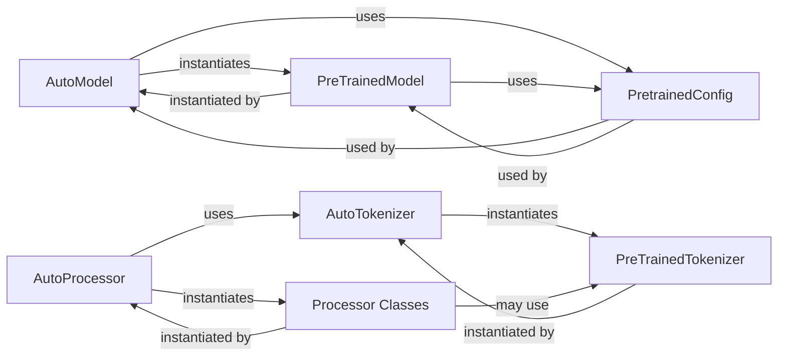

## Details

The `transformers` library's core architecture for model and data preparation revolves around a set of "Auto" factory classes and their corresponding abstract base components. `AutoModel` serves as the central entry point for loading pre-trained deep learning models, dynamically instantiating concrete `PreTrainedModel` subclasses based on a `PretrainedConfig`. Similarly, `AutoTokenizer` handles the loading and instantiation of `PreTrainedTokenizer` subclasses for text processing. For multi-modal data preparation, `AutoProcessor` acts as a factory, instantiating various `Processor Classes` (represented by mixins like `ImageProcessingMixin`) that encapsulate data transformation logic, often leveraging `AutoTokenizer` internally. This design promotes flexibility and extensibility, allowing new models, tokenizers, and processors to be integrated seamlessly without modifying core logic. The `PretrainedConfig` component is fundamental, providing the necessary metadata and architectural parameters for both `AutoModel` and `PreTrainedModel` to ensure correct initialization and operation.

### AutoModel
The primary factory component responsible for inferring and instantiating the correct PreTrainedModel subclass based on a model identifier or configuration. It handles loading pre-trained weights and configurations.

**Related Classes/Methods**:

- <a href="https://github.com/huggingface/transformers/blob/main/src/transformers/models/auto/modeling_auto.py#L1858-L1859" target="_blank" rel="noopener noreferrer">`transformers.models.auto.modeling_auto.AutoModel`:1858-1859</a>

### AutoTokenizer
The primary factory component for inferring and instantiating the appropriate PreTrainedTokenizer subclass. It manages the loading of tokenizer-specific files like vocabulary and special tokens.

**Related Classes/Methods**:

- <a href="https://github.com/huggingface/transformers/blob/main/src/transformers/models/auto/tokenization_auto.py#L909-L1193" target="_blank" rel="noopener noreferrer">`transformers.models.auto.tokenization_auto.AutoTokenizer`:909-1193</a>

### AutoProcessor
The primary factory component for inferring and instantiating multi-modal Processor Classes. These processors often combine tokenization and feature extraction logic, coordinating the preparation of diverse input types.

**Related Classes/Methods**:

- <a href="https://github.com/huggingface/transformers/blob/main/src/transformers/models/auto/processing_auto.py#L178-L430" target="_blank" rel="noopener noreferrer">`transformers.models.auto.processing_auto.AutoProcessor`:178-430</a>

### PreTrainedModel
An abstract base class defining the common interface and core functionalities for all pre-trained deep learning models within the library. AutoModel instantiates concrete subclasses of this component.

**Related Classes/Methods**:

- <a href="https://github.com/huggingface/transformers/blob/main/src/transformers/modeling_utils.py#L2034-L6016" target="_blank" rel="noopener noreferrer">`transformers.modeling_utils.PreTrainedModel`:2034-6016</a>

### PreTrainedTokenizer
An abstract base class establishing the standard interface for all tokenizers. AutoTokenizer instantiates concrete subclasses of this component, ensuring consistent text processing.

**Related Classes/Methods**:

- <a href="https://github.com/huggingface/transformers/blob/main/src/transformers/tokenization_utils_base.py#L1374-L4159" target="_blank" rel="noopener noreferrer">`transformers.tokenization_utils_base.PreTrainedTokenizer`:1374-4159</a>

### PretrainedConfig
An abstract base class representing the configuration for models. It encapsulates architectural parameters and metadata, loaded and used by AutoModel to correctly initialize PreTrainedModel instances.

**Related Classes/Methods**:

- <a href="https://github.com/huggingface/transformers/blob/main/src/transformers/configuration_utils.py#L53-L1236" target="_blank" rel="noopener noreferrer">`transformers.configuration_utils.PretrainedConfig`:53-1236</a>

### Processor Classes
Abstract base classes or mixins that define the common interface for data preparation components, often combining tokenization and feature extraction. These are instantiated by AutoProcessor.

**Related Classes/Methods**:

- <a href="https://github.com/huggingface/transformers/blob/main/src/transformers/image_processing_utils.py#L30-L1000" target="_blank" rel="noopener noreferrer">`transformers.image_processing_utils.ImageProcessingMixin`:30-1000</a>

### [FAQ](https://github.com/CodeBoarding/GeneratedOnBoardings/tree/main?tab=readme-ov-file#faq)