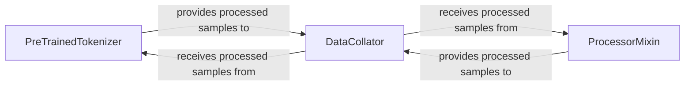

## Details

The Data Preparation & Tokenization subsystem is responsible for transforming raw input data (text, images, audio) into a numerical format suitable for model consumption. This includes tokenization for text, feature extraction for other modalities, and the collation of processed data into batches for efficient model training and inference. Its boundaries are defined by the initial processing of raw data up to the point where it is ready to be fed into a deep learning model.

### PreTrainedTokenizer
This component is the cornerstone for handling text-based data. It encapsulates the vocabulary, special tokens, and the logic required to convert raw text strings into numerical input IDs, attention masks, and token type IDs. Its fundamental importance lies in standardizing text input for NLP models, a core function of an ML Toolkit.

**Related Classes/Methods**:

- <a href="https://github.com/huggingface/transformers/blob/main/src/transformers/tokenization_utils.py#L406-L1135" target="_blank" rel="noopener noreferrer">`PreTrainedTokenizer`:406-1135</a>

### ProcessorMixin
A versatile component (often implemented as a mixin or base class) that provides functionalities for feature extraction and pre-processing of non-textual data (e.g., images, audio) or multimodal inputs. This includes operations like resizing, normalization, and format conversion, making diverse data types compatible with models.

**Related Classes/Methods**:

- <a href="https://github.com/huggingface/transformers/blob/main/src/transformers/processing_utils.py#L508-L1686" target="_blank" rel="noopener noreferrer">`ProcessorMixin`:508-1686</a>

### DataCollator
This component is responsible for taking a list of individual processed samples (outputs from tokenizers or processors) and dynamically batching them into tensors. It often handles padding to ensure uniform input lengths within a batch, which is critical for efficient GPU utilization in deep learning.

**Related Classes/Methods**:

- <a href="https://github.com/huggingface/transformers/blob/main/src/transformers/data/data_collator.py" target="_blank" rel="noopener noreferrer">`DataCollator`</a>

### [FAQ](https://github.com/CodeBoarding/GeneratedOnBoardings/tree/main?tab=readme-ov-file#faq)