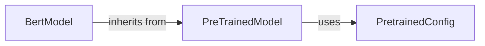

## Details

The `Model Core & Architectures` subsystem is defined by its role as the central hub for deep learning models within the `transformers` library. Its boundaries encompass foundational classes for model definition, loading, saving, and manipulation, as well as specific neural network implementations. Key source files include `src/transformers/modeling_utils.py`, `src/transformers/configuration_utils.py`, and architecture-specific files like `src/transformers/models/bert/modeling_bert.py`.

### PreTrainedModel
This is the abstract base class for all deep learning models. It provides the fundamental interface and common functionalities for model interaction, including loading pre-trained weights, saving model states, and defining the standard forward pass. It serves as the primary abstraction for model extensibility and reusability across various architectures.

**Related Classes/Methods**:

- <a href="https://github.com/huggingface/transformers/blob/main/src/transformers/modeling_flax_utils.py#L150-L1235" target="_blank" rel="noopener noreferrer">`PreTrainedModel`:150-1235</a>

### PretrainedConfig
This component encapsulates all architectural hyperparameters and configuration details necessary to instantiate and reconstruct a specific model. It ensures consistent model definition and sharing by storing parameters like layer counts, hidden dimensions, and vocabulary sizes. It acts as the blueprint for a model's structure.

**Related Classes/Methods**:

- <a href="https://github.com/huggingface/transformers/blob/main/src/transformers/configuration_utils.py#L53-L1236" target="_blank" rel="noopener noreferrer">`PretrainedConfig`:53-1236</a>

### BertModel
This represents concrete implementations of specific neural network architectures (e.g., BERT, GPT-2, T5). These classes inherit from `PreTrainedModel` and define the unique layers, weights, and forward pass logic specific to their respective architectures. `BertModel` is a representative example of how various models are concretely implemented within the framework.

**Related Classes/Methods**:

- <a href="https://github.com/huggingface/transformers/blob/main/src/transformers/models/deprecated/qdqbert/modeling_qdqbert.py#L802-L981" target="_blank" rel="noopener noreferrer">`BertModel`:802-981</a>

### [FAQ](https://github.com/CodeBoarding/GeneratedOnBoardings/tree/main?tab=readme-ov-file#faq)