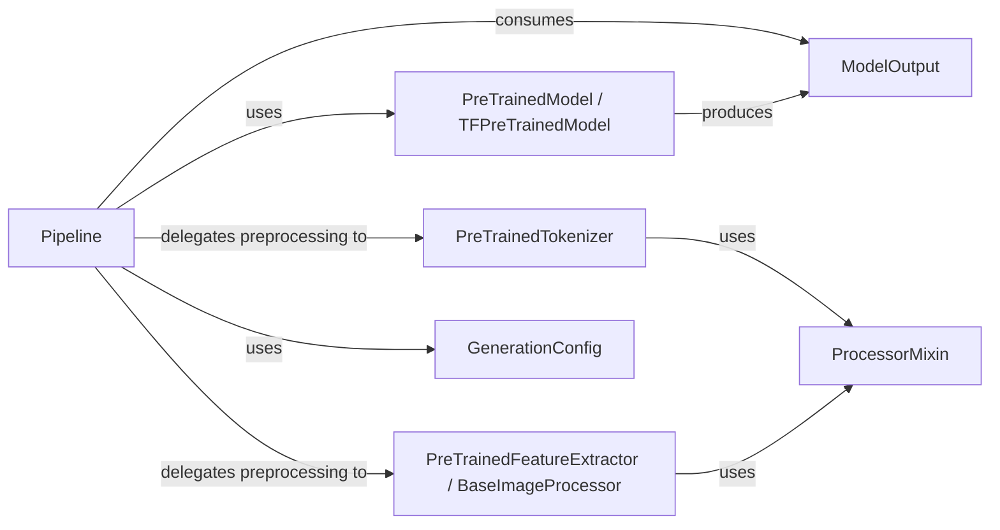

## Details

The `transformers` library's inference subsystem is orchestrated by the `Pipeline` component, which provides a high-level API for various machine learning tasks. The `Pipeline` delegates input preprocessing to specialized components: `PreTrainedTokenizer` for text-based inputs and `PreTrainedFeatureExtractor / BaseImageProcessor` for non-textual data. Both preprocessing components leverage the `ProcessorMixin` for common functionalities. After preprocessing, the `Pipeline` utilizes `PreTrainedModel / TFPreTrainedModel` to perform the actual inference, which in turn produces `ModelOutput` objects containing the raw results. For generative tasks, the `Pipeline` configures the model's behavior using `GenerationConfig`. This modular design ensures clear separation of concerns, enabling flexible and efficient execution of diverse ML inference workflows.

### Pipeline
The central orchestrator of the inference workflow. It provides a unified, high-level API for various ML tasks, managing the sequence of operations from raw input to final output.

**Related Classes/Methods**:

- <a href="https://github.com/huggingface/transformers/blob/main/src/transformers/pipelines/base.py#L906-L1473" target="_blank" rel="noopener noreferrer">`transformers.pipelines.base.Pipeline`:906-1473</a>

### PreTrainedModel / TFPreTrainedModel
Represents the core deep learning model responsible for performing the actual inference. These classes encapsulate the model architecture and loaded weights, providing the forward pass functionality.

**Related Classes/Methods**:

- <a href="https://github.com/huggingface/transformers/blob/main/src/transformers/modeling_utils.py#L2034-L6016" target="_blank" rel="noopener noreferrer">`transformers.modeling_utils.PreTrainedModel`:2034-6016</a>
- <a href="https://github.com/huggingface/transformers/blob/main/src/transformers/modeling_tf_utils.py#L1109-L3244" target="_blank" rel="noopener noreferrer">`transformers.modeling_tf_utils.TFPreTrainedModel`:1109-3244</a>

### PreTrainedTokenizer
Handles the preprocessing of text inputs. It converts raw text into numerical representations (e.g., token IDs, attention masks) suitable for text-based models.

**Related Classes/Methods**:

- <a href="https://github.com/huggingface/transformers/blob/main/src/transformers/tokenization_utils_base.py#L1374-L4159" target="_blank" rel="noopener noreferrer">`transformers.tokenization_utils_base.PreTrainedTokenizer`:1374-4159</a>

### PreTrainedFeatureExtractor / BaseImageProcessor
Manages the preprocessing of non-textual inputs (e.g., images, audio). It transforms raw data into features or tensors compatible with vision or audio models.

**Related Classes/Methods**:

- <a href="https://github.com/huggingface/transformers/blob/main/src/transformers/feature_extraction_utils.py" target="_blank" rel="noopener noreferrer">`transformers.feature_extraction_utils.PreTrainedFeatureExtractor`</a>
- <a href="https://github.com/huggingface/transformers/blob/main/src/transformers/image_processing_utils.py#L37-L167" target="_blank" rel="noopener noreferrer">`transformers.image_processing_utils.BaseImageProcessor`:37-167</a>

### ProcessorMixin
A mixin class providing common functionalities and utilities for various data processors (tokenizers, feature extractors). It promotes code reuse across different preprocessing components.

**Related Classes/Methods**:

- <a href="https://github.com/huggingface/transformers/blob/main/src/transformers/processing_utils.py#L508-L1686" target="_blank" rel="noopener noreferrer">`transformers.processing_utils.ProcessorMixin`:508-1686</a>

### ModelOutput
A standardized data structure used to encapsulate the raw outputs generated by PreTrainedModels after inference. It provides a consistent way for the Pipeline to receive and further process model results.

**Related Classes/Methods**:

- <a href="https://github.com/huggingface/transformers/blob/main/src/transformers/utils/generic.py" target="_blank" rel="noopener noreferrer">`transformers.utils.generic.ModelOutput`</a>

### GenerationConfig
Defines the parameters and strategies for text generation tasks (e.g., beam search, sampling, max length). The Pipeline uses this configuration when performing generative inference with a model.

**Related Classes/Methods**:

- <a href="https://github.com/huggingface/transformers/blob/main/src/transformers/generation/configuration_utils.py" target="_blank" rel="noopener noreferrer">`transformers.generation.configuration_utils.GenerationConfig`</a>

### [FAQ](https://github.com/CodeBoarding/GeneratedOnBoardings/tree/main?tab=readme-ov-file#faq)