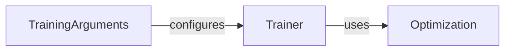

## Details

The `transformers` library provides a robust framework for training and evaluating deep learning models. The core training process revolves around three key components: `Trainer`, `TrainingArguments`, and `Optimization`. The `Trainer` orchestrates the entire training and evaluation lifecycle, taking a model, data, and `TrainingArguments` as input, managing the training loop, data loading, forward/backward passes, and evaluation. `TrainingArguments` acts as a configuration hub, encapsulating all hyperparameters and settings required for training, providing a clear and centralized way to define how the training process should behave. `Optimization` provides the algorithms and schedulers responsible for updating the model's parameters during training, with the `Trainer` utilizing it to minimize the loss function based on the gradients computed during the backward pass. The main flow involves the `Trainer` being initialized with an instance of `TrainingArguments` to configure its behavior. During the training loop, the `Trainer` interacts with the `Optimization` component to perform parameter updates. The `transformers` training subsystem is designed around a clear separation of concerns, enabling flexible and efficient deep learning model training. The `Trainer` acts as the central orchestrator, encapsulating the training loop and managing the overall process. It is configured by `TrainingArguments`, which centralizes all training-related hyperparameters and settings, promoting clarity and ease of modification. The `Trainer` then leverages the `Optimization` component to perform the actual model parameter updates, utilizing various optimization algorithms and learning rate schedulers. This modular design allows for easy customization and extension of the training process, making it adaptable to diverse deep learning tasks and models.

### Trainer
The Trainer component acts as the central orchestrator for deep learning model training and evaluation. It encapsulates the entire training loop, managing data flow, model forward/backward passes, optimization steps, and evaluation routines. Its design aligns with the "Pipeline Pattern" and "Component-based Architecture" by providing a high-level abstraction for the training process, making it easy to use while allowing for extensibility.

**Related Classes/Methods**:

- <a href="https://github.com/huggingface/transformers/blob/main/src/transformers/trainer.py" target="_blank" rel="noopener noreferrer">`transformers.Trainer`</a>

### TrainingArguments
The TrainingArguments component is a data class that defines and holds all configurable parameters for the training process. This includes hyperparameters (e.g., learning rate, batch size, number of epochs), logging settings, evaluation strategies, and checkpointing configurations. It promotes "Clear Separation of Concerns" by centralizing all training-related configurations.

**Related Classes/Methods**:

- <a href="https://github.com/huggingface/transformers/blob/main/src/transformers/training_args.py" target="_blank" rel="noopener noreferrer">`transformers.TrainingArguments`</a>

### Optimization [[Expand]](./Optimization.md)
The Optimization component contains implementations of various optimization algorithms (e.g., AdamW) and learning rate schedulers. These components are responsible for updating model parameters based on computed gradients to minimize the loss function. It represents the core mathematical and algorithmic aspects of model parameter updates.

**Related Classes/Methods**:

- <a href="https://github.com/huggingface/transformers/blob/main/src/transformers/optimization.py" target="_blank" rel="noopener noreferrer">`transformers.Optimization`</a>

### [FAQ](https://github.com/CodeBoarding/GeneratedOnBoardings/tree/main?tab=readme-ov-file#faq)