```mermaid
graph LR
    Component_Loading_Abstraction["Component Loading & Abstraction"]
    Model_Core_Architectures["Model Core & Architectures"]
    Data_Preparation_Tokenization["Data Preparation & Tokenization"]
    Pipelines["Pipelines"]
    Training_Optimization["Training & Optimization"]
    Model_Optimization_Interoperability["Model Optimization & Interoperability"]
    Component_Loading_Abstraction -- "Instantiates" --> Model_Core_Architectures
    Component_Loading_Abstraction -- "Instantiates" --> Data_Preparation_Tokenization
    Data_Preparation_Tokenization -- "Provides Data To" --> Model_Core_Architectures
    Data_Preparation_Tokenization -- "Provides Data To" --> Training_Optimization
    Pipelines -- "Uses" --> Component_Loading_Abstraction
    Pipelines -- "Orchestrates" --> Data_Preparation_Tokenization
    Pipelines -- "Orchestrates" --> Model_Core_Architectures
    Training_Optimization -- "Manages" --> Model_Core_Architectures
    Training_Optimization -- "Integrates With" --> Model_Optimization_Interoperability
    Model_Optimization_Interoperability -- "Optimizes" --> Model_Core_Architectures
    click Component_Loading_Abstraction href "https://github.com/CodeBoarding/GeneratedOnBoardings/blob/main/transformers/Component_Loading_Abstraction.md" "Details"
    click Model_Core_Architectures href "https://github.com/CodeBoarding/GeneratedOnBoardings/blob/main/transformers/Model_Core_Architectures.md" "Details"
    click Data_Preparation_Tokenization href "https://github.com/CodeBoarding/GeneratedOnBoardings/blob/main/transformers/Data_Preparation_Tokenization.md" "Details"
    click Pipelines href "https://github.com/CodeBoarding/GeneratedOnBoardings/blob/main/transformers/Pipelines.md" "Details"
    click Training_Optimization href "https://github.com/CodeBoarding/GeneratedOnBoardings/blob/main/transformers/Training_Optimization.md" "Details"
    click Model_Optimization_Interoperability href "https://github.com/CodeBoarding/GeneratedOnBoardings/blob/main/transformers/Model_Optimization_Interoperability.md" "Details"
```

## Details

The `transformers` library presents a robust and modular architecture centered on facilitating the entire lifecycle of deep learning models. At its core, `Component Loading & Abstraction` provides a simplified interface for users to instantiate various model and data processing components. Raw data is transformed by `Data Preparation & Tokenization` before being fed into the `Model Core & Architectures` for inference or directed to `Training & Optimization` for model training. The `Training & Optimization` component oversees the model's learning process, directly interacting with the `Model Core & Architectures` and integrating with `Model Optimization & Interoperability` to refine model performance. For streamlined end-to-end tasks, `Pipelines` abstract away the underlying complexities, orchestrating the necessary interactions between loading, data preparation, and model inference components. This design ensures clear separation of concerns, promoting maintainability and extensibility.

### Component Loading & Abstraction [[Expand]](./Component_Loading_Abstraction.md)
The primary entry point for users to load and instantiate various library components (models, tokenizers, processors) without needing to know specific class implementations. It leverages "Auto" classes to infer and load the correct architecture.

**Related Classes/Methods**:

- <a href="https://github.com/huggingface/transformers/blob/main/src/transformers/models/auto/modeling_auto.py" target="_blank" rel="noopener noreferrer">`src/transformers/models/auto/modeling_auto.py`</a>
- <a href="https://github.com/huggingface/transformers/blob/main/src/transformers/models/auto/tokenization_auto.py" target="_blank" rel="noopener noreferrer">`src/transformers/models/auto/tokenization_auto.py`</a>
- <a href="https://github.com/huggingface/transformers/blob/main/src/transformers/models/auto/processing_auto.py" target="_blank" rel="noopener noreferrer">`src/transformers/models/auto/processing_auto.py`</a>

### Model Core & Architectures [[Expand]](./Model_Core_Architectures.md)
The central hub for all deep learning models, providing foundational classes for model definition, loading, saving, and general manipulation. It also encapsulates specific neural network implementations for various architectures.

**Related Classes/Methods**:

- <a href="https://github.com/huggingface/transformers/blob/main/src/transformers/modeling_utils.py" target="_blank" rel="noopener noreferrer">`src/transformers/modeling_utils.py`</a>
- <a href="https://github.com/huggingface/transformers/blob/main/src/transformers/configuration_utils.py" target="_blank" rel="noopener noreferrer">`src/transformers/configuration_utils.py`</a>
- <a href="https://github.com/huggingface/transformers/blob/main/src/transformers/models/bert/modeling_bert.py" target="_blank" rel="noopener noreferrer">`src/transformers/models/bert/modeling_bert.py`</a>

### Data Preparation & Tokenization [[Expand]](./Data_Preparation_Tokenization.md)
Responsible for transforming raw input data (text, images, audio) into a numerical format suitable for model consumption, including tokenization, feature extraction, and data collation.

**Related Classes/Methods**:

- <a href="https://github.com/huggingface/transformers/blob/main/src/transformers/tokenization_utils_base.py" target="_blank" rel="noopener noreferrer">`src/transformers/tokenization_utils_base.py`</a>
- <a href="https://github.com/huggingface/transformers/blob/main/src/transformers/processing_utils.py" target="_blank" rel="noopener noreferrer">`src/transformers/processing_utils.py`</a>
- <a href="https://github.com/huggingface/transformers/blob/main/src/transformers/data/data_collator.py" target="_blank" rel="noopener noreferrer">`src/transformers/data/data_collator.py`</a>

### Pipelines [[Expand]](./Pipelines.md)
High-level, end-to-end APIs that encapsulate the entire inference workflow for common ML tasks, orchestrating preprocessing, model inference, and post-processing.

**Related Classes/Methods**:

- <a href="https://github.com/huggingface/transformers/blob/main/src/transformers/pipelines/base.py" target="_blank" rel="noopener noreferrer">`src/transformers/pipelines/base.py`</a>

### Training & Optimization [[Expand]](./Training_Optimization.md)
A comprehensive framework for training deep learning models, managing the training loop, data loading, optimization strategies, learning rate scheduling, and evaluation.

**Related Classes/Methods**:

- <a href="https://github.com/huggingface/transformers/blob/main/src/transformers/trainer.py" target="_blank" rel="noopener noreferrer">`src/transformers/trainer.py`</a>
- <a href="https://github.com/huggingface/transformers/blob/main/src/transformers/training_args.py" target="_blank" rel="noopener noreferrer">`src/transformers/training_args.py`</a>
- <a href="https://github.com/huggingface/transformers/blob/main/src/transformers/optimization.py" target="_blank" rel="noopener noreferrer">`src/transformers/optimization.py`</a>

### Model Optimization & Interoperability [[Expand]](./Model_Optimization_Interoperability.md)
Focuses on techniques to enhance model performance (e.g., reducing size, increasing inference speed) and ensuring compatibility across different deep learning frameworks through quantization and weight conversion utilities.

**Related Classes/Methods**:

- <a href="https://github.com/huggingface/transformers/blob/main/src/transformers/quantizers/base.py" target="_blank" rel="noopener noreferrer">`src/transformers/quantizers/base.py`</a>
- <a href="https://github.com/huggingface/transformers/blob/main/src/transformers/modeling_flax_pytorch_utils.py" target="_blank" rel="noopener noreferrer">`src.transformers.modeling_flax_pytorch_utils.py`</a>
- <a href="https://github.com/huggingface/transformers/blob/main/src/transformers/modeling_tf_pytorch_utils.py" target="_blank" rel="noopener noreferrer">`src.transformers.modeling_tf_pytorch_utils.py`</a>

### [FAQ](https://github.com/CodeBoarding/GeneratedOnBoardings/tree/main?tab=readme-ov-file#faq)