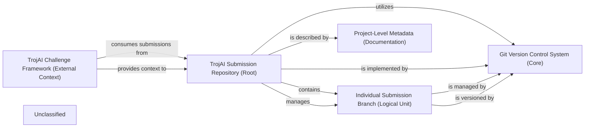

## Details

The `trojai-submission-all` project functions as a central repository for AI/ML challenge submissions, structured around Git for version control. The `TrojAI Submission Repository (Root)` serves as the primary aggregation point, containing multiple `Individual Submission Branch (Logical Unit)` instances, each representing a distinct submission. The `Git Version Control System (Core)` underpins all versioning and branching operations within the repository. Project-level documentation is maintained in `Project-Level Metadata (Documentation)`. The entire system operates within the broader context of the `TrojAI Challenge Framework (External Context)`, which defines the rules and evaluation criteria for submissions. Data flows primarily involve submissions being committed to individual branches, managed by Git, and ultimately consumed by the external TrojAI framework.

### TrojAI Submission Repository (Root)
The primary Git repository (`trojai-submission-all`) serving as the central aggregation point and storage for all AI/ML challenge submissions.

**Related Classes/Methods**:

- <a href="https://github.com/UMBC-Coral-Lab/trojai-submission-all/blob/main/" target="_blank" rel="noopener noreferrer">`trojai-submission-all`</a>

### Git Version Control System (Core)
The foundational Git system providing core functionalities for versioning, branching, merging, and maintaining the history of the `TrojAI Submission Repository`. This is an external system, not part of the project's codebase.

**Related Classes/Methods**:

- `N/A (External System)`

### Individual Submission Branch (Logical Unit)
A distinct Git branch within the `TrojAI Submission Repository`, encapsulating a single, self-contained AI/ML model submission for a specific TrojAI challenge round. This is a logical construct managed by Git, not a specific source file.

**Related Classes/Methods**:

- `N/A (Logical Unit)`

### Project-Level Metadata (Documentation)
High-level descriptive information about the entire `TrojAI Submission Repository`, including project overview, guidelines, and general challenge context.

**Related Classes/Methods**:

- <a href="https://github.com/UMBC-Coral-Lab/trojai-submission-all/blob/mainREADME.md" target="_blank" rel="noopener noreferrer">`README.md`</a>

### TrojAI Challenge Framework (External Context)
An external conceptual system representing the broader TrojAI program, which defines challenge rules, rounds, and evaluation methodologies. This component is external to the project's codebase.

**Related Classes/Methods**:

- `N/A (External)`

### Unclassified
Component for all unclassified files and utility functions (Utility functions/External Libraries/Dependencies)

**Related Classes/Methods**: _None_

### [FAQ](https://github.com/CodeBoarding/GeneratedOnBoardings/tree/main?tab=readme-ov-file#faq)