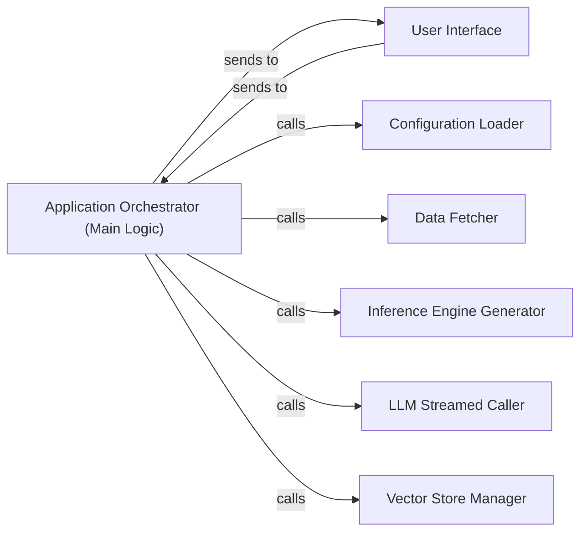

## Details

The trt-llm-rag-linux project implements a Retrieval-Augmented Generation (RAG) pipeline, with the Application Orchestrator (Main Logic) serving as the central control unit. This orchestrator coordinates interactions between the User Interface and various backend components. Upon receiving a user query from the User Interface, the Application Orchestrator leverages the Configuration Loader to ensure proper application settings, the Inference Engine Generator to prepare the LLM environment, and the Vector Store Manager for efficient context retrieval. The Data Fetcher is responsible for acquiring and preparing external data for the vector store. Finally, the LLM Streamed Caller facilitates real-time interaction with the Large Language Model, with responses streamed back to the User Interface. This architecture ensures a modular and efficient flow for processing user queries and generating relevant, context-aware responses.

### Application Orchestrator (Main Logic)
This is the overarching component that embodies the core application logic. It acts as the central hub, receiving user requests from the UI, coordinating the sequence of operations across the RAG pipeline, managing the application's state, and directing data flow between all integrated layers. It ensures a cohesive end-to-end process.

**Related Classes/Methods**:

- <a href="https://github.com/KingXHJ/trt-llm-rag-linux/blob/master/ui/user_interface.py#L279-L288" target="_blank" rel="noopener noreferrer">`app`:279-288</a>

### Configuration Loader
Responsible for reading and loading all necessary application configurations. This includes settings for models, data paths, and other operational parameters, ensuring the application initializes and runs with the correct environment.

**Related Classes/Methods**:

- <a href="https://github.com/KingXHJ/trt-llm-rag-linux/blob/master/app.py#L49-L59" target="_blank" rel="noopener noreferrer">`app.read_config`:49-59</a>

### Data Fetcher
Manages the retrieval of raw data, such as YouTube transcripts or other document types, which are then prepared for ingestion into the RAG pipeline. This component handles the initial acquisition of information.

**Related Classes/Methods**:

- <a href="https://github.com/KingXHJ/trt-llm-rag-linux/blob/master/app.py#L202-L247" target="_blank" rel="noopener noreferrer">`app.fetch_transcripts`:202-247</a>

### Inference Engine Generator
Handles the initialization and setup of the optimized Large Language Model (LLM) inference engine. This involves configuring and preparing the runtime environment for efficient model execution, often leveraging technologies like TensorRT-LLM.

**Related Classes/Methods**:

- <a href="https://github.com/KingXHJ/trt-llm-rag-linux/blob/master/app.py#L125-L147" target="_blank" rel="noopener noreferrer">`app.generate_inferance_engine`:125-147</a>

### LLM Streamed Caller
Facilitates direct communication with the Large Language Model, specifically designed to handle and process streamed responses. This component is crucial for interactive and real-time user experiences where LLM output is delivered incrementally.

**Related Classes/Methods**:

- <a href="https://github.com/KingXHJ/trt-llm-rag-linux/blob/master/app.py#L254-L259" target="_blank" rel="noopener noreferrer">`app.call_llm_streamed`:254-259</a>

### Vector Store Manager
Manages interactions with the FAISS vector store. Its responsibilities include storing generated embeddings and executing similarity search queries to retrieve relevant context for the LLM, forming the core of the retrieval mechanism.

**Related Classes/Methods**:

- <a href="https://github.com/KingXHJ/trt-llm-rag-linux/blob/master/faiss_vector_storage.py#L31-L95" target="_blank" rel="noopener noreferrer">`faiss_vector_storage.FaissEmbeddingStorage`:31-95</a>

### User Interface
Handles user input, displays responses, and manages the overall graphical user interface. It sends user requests to the Application Orchestrator and receives responses for display.

**Related Classes/Methods**:

- <a href="https://github.com/KingXHJ/trt-llm-rag-linux/blob/master/ui/user_interface.py#L37-L1184" target="_blank" rel="noopener noreferrer">`ui.user_interface.MainInterface`:37-1184</a>

### [FAQ](https://github.com/CodeBoarding/GeneratedOnBoardings/tree/main?tab=readme-ov-file#faq)