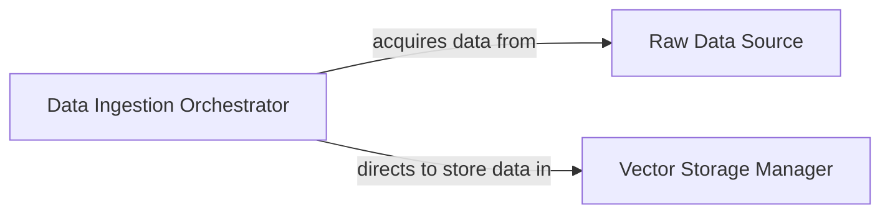

## Details

This subsystem is responsible for the acquisition, parsing, and preparation of raw data from various sources, transforming it into a format suitable for embedding and storage in the vector store. It forms the initial crucial step in building the knowledge base for the Retrieval-Augmented Generation (RAG) application.

### Data Ingestion Orchestrator
This component acts as the primary control point for the data ingestion and processing pipeline. It responds to user interface events, identifies and fetches raw data from specified sources (e.g., local directories, YouTube URLs), and triggers the subsequent steps of data preparation, embedding generation, and vector index regeneration. It ensures that the raw data is correctly loaded and passed on for further processing.

**Related Classes/Methods**:

- <a href="https://github.com/KingXHJ/trt-llm-rag-linux/blob/master/ui/user_interface.py#L279-L288" target="_blank" rel="noopener noreferrer">`app`:279-288</a>

### Raw Data Source
This represents the collection of raw, unstructured text files and other data types (e.g., documents, YouTube transcripts) that serve as the input for the data ingestion process. It is the repository from which the RAG system acquires its foundational knowledge.

**Related Classes/Methods**:

- <a href="https://github.com/KingXHJ/trt-llm-rag-linux/blob/master/dataset/" target="_blank" rel="noopener noreferrer">`dataset`</a>

### Vector Storage Manager
This component is responsible for managing the FAISS vector index, which stores the numerical embeddings of the processed text data. It handles the creation, updating, and maintenance of the vector store, making the embedded knowledge base available for efficient similarity search and retrieval by other parts of the RAG system.

**Related Classes/Methods**:

- <a href="https://github.com/KingXHJ/trt-llm-rag-linux/blob/master/faiss_vector_storage.py" target="_blank" rel="noopener noreferrer">`faiss_vector_storage`</a>

### [FAQ](https://github.com/CodeBoarding/GeneratedOnBoardings/tree/main?tab=readme-ov-file#faq)