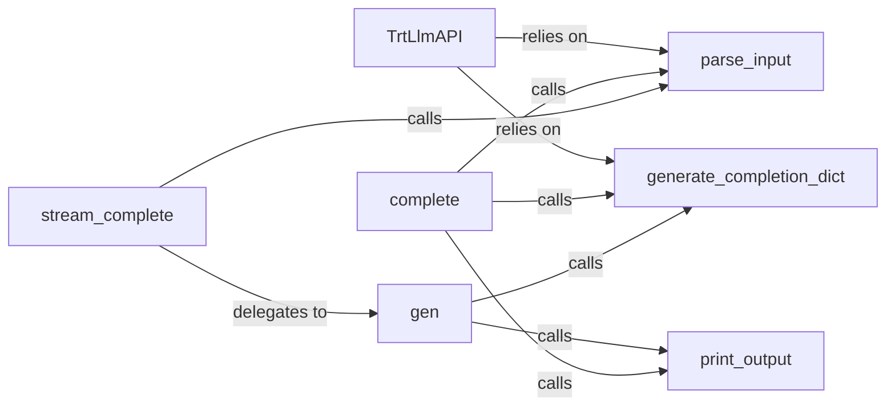

## Details

LLM Inference Layer subsystem analysis

### TrtLlmAPI
The core interface and orchestrator of the LLM inference layer. It initializes and manages the TensorRT-LLM model, handles configuration, and exposes the primary methods for interacting with the LLM. It acts as the entry point for all LLM operations within the application.

**Related Classes/Methods**:

- <a href="https://github.com/KingXHJ/trt-llm-rag-linux/blob/master/trt_llama_api.py#L54-L393" target="_blank" rel="noopener noreferrer">`trt_llama_api.TrtLlmAPI`:54-393</a>

### parse_input
Responsible for preparing the raw input text into a format suitable for the LLM. This includes tokenization and applying specific prompt templates to ensure the LLM receives correctly structured and contextualized prompts.

**Related Classes/Methods**:

- <a href="https://github.com/KingXHJ/trt-llm-rag-linux/blob/master/trt_llama_api.py#L222-L256" target="_blank" rel="noopener noreferrer">`trt_llama_api.parse_input`:222-256</a>

### complete
Executes a synchronous LLM completion. It orchestrates the entire process for a single, non-streaming response: processing the input, invoking the underlying LLM, and formatting the raw output into a structured response.

**Related Classes/Methods**:

- <a href="https://github.com/KingXHJ/trt-llm-rag-linux/blob/master/trt_llama_api.py#L175-L220" target="_blank" rel="noopener noreferrer">`trt_llama_api.complete`:175-220</a>

### stream_complete
Initiates an asynchronous (streaming) LLM completion. This component sets up the generation process to yield tokens as they are produced by the LLM, providing a more responsive user experience, especially for longer generations.

**Related Classes/Methods**:

- <a href="https://github.com/KingXHJ/trt-llm-rag-linux/blob/master/trt_llama_api.py#L335-L386" target="_blank" rel="noopener noreferrer">`trt_llama_api.stream_complete`:335-386</a>

### gen
The core generator for streaming completions. It continuously interacts with the TensorRT-LLM runtime to fetch and yield new tokens as they become available. It also handles the incremental formatting of the output for each chunk of generated text.

**Related Classes/Methods**:

- <a href="https://github.com/KingXHJ/trt-llm-rag-linux/blob/master/trt_llama_api.py#L369-L385" target="_blank" rel="noopener noreferrer">`trt_llama_api.gen`:369-385</a>

### generate_completion_dict
Structures the raw LLM output into a standardized dictionary format. This ensures that the responses conform to a consistent API structure (e.g., OpenAI-like completion object), making it easier for downstream components to consume the LLM's output.

**Related Classes/Methods**:

- <a href="https://github.com/KingXHJ/trt-llm-rag-linux/blob/master/trt_llama_api.py#L306-L333" target="_blank" rel="noopener noreferrer">`trt_llama_api.generate_completion_dict`:306-333</a>

### print_output
Handles the logging or display of the LLM's output during the inference process. This component is primarily for debugging, monitoring, and providing real-time feedback on the generation progress.

**Related Classes/Methods**:

- <a href="https://github.com/KingXHJ/trt-llm-rag-linux/blob/master/trt_llama_api.py#L266-L290" target="_blank" rel="noopener noreferrer">`trt_llama_api.print_output`:266-290</a>

### [FAQ](https://github.com/CodeBoarding/GeneratedOnBoardings/tree/main?tab=readme-ov-file#faq)