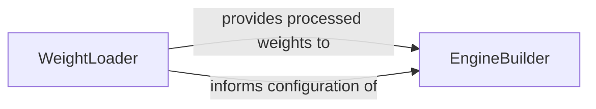

## Details

The trt-llm-rag-linux project is designed to streamline the process of converting Large Language Models into high-performance TensorRT-LLM engines. At its heart, the architecture is composed of two primary conceptual components: the WeightLoader and the EngineBuilder. The WeightLoader acts as the initial processing unit, handling the complex task of loading, preprocessing, and quantizing LLM weights from diverse formats and sources. This ensures that the raw model weights are transformed into a state suitable for optimization. Subsequently, the EngineBuilder takes these prepared weights, along with various configuration parameters, to construct and optimize the TensorRT-LLM engine. This component is responsible for defining the neural network structure within TensorRT and serializing the final, optimized engine for efficient deployment and inference. The interaction between these two components is sequential and critical, with the WeightLoader directly feeding its output to the EngineBuilder, thereby enabling the creation of a highly optimized LLM inference solution.

### EngineBuilder
This component is responsible for orchestrating the compilation and optimization of a Large Language Model into a highly efficient TensorRT-LLM engine. Its tasks include parsing configuration arguments, defining the neural network structure for TensorRT, and serializing the optimized engine for deployment. It acts as the core orchestrator for the TensorRT-LLM engine creation process.

**Related Classes/Methods**:

- <a href="https://github.com/KingXHJ/trt-llm-rag-linux/blob/master/build.py#L802-L891" target="_blank" rel="noopener noreferrer">`build`:802-891</a>

### WeightLoader
This component manages the loading, preprocessing, and various forms of quantization (e.g., SmoothQuant, GPTQ, AWQ) of LLM weights from diverse sources (e.g., Hugging Face, Meta Llama, binary files). It handles the intricate details of weight manipulation, splitting, and format conversion necessary for compatibility with the TensorRT-LLM builder. It ensures that the raw LLM weights are prepared in a format suitable for the EngineBuilder.

**Related Classes/Methods**:

- <a href="https://github.com/KingXHJ/trt-llm-rag-linux/blob/master/weight.py#L159-L166" target="_blank" rel="noopener noreferrer">`weight`:159-166</a>

### [FAQ](https://github.com/CodeBoarding/GeneratedOnBoardings/tree/main?tab=readme-ov-file#faq)