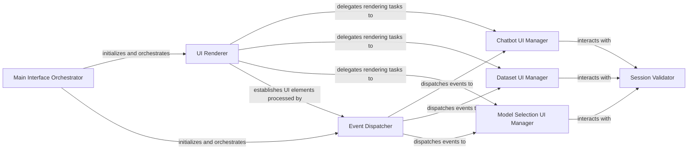

## Details

The User Interface (UI) Layer is primarily encapsulated within the user_interface.py file, specifically centered around the MainInterface class. This layer is responsible for all interactive elements, user input, and display of application state.

### Main Interface Orchestrator
Serves as the primary entry point for the UI application. It initializes the Gradio interface, sets up the overall layout, and orchestrates the rendering and event handling of all sub-components.

**Related Classes/Methods**:

- <a href="https://github.com/KingXHJ/trt-llm-rag-linux/blob/master/ui/user_interface.py#L37-L1184" target="_blank" rel="noopener noreferrer">`MainInterface`:37-1184</a>

### UI Renderer
Manages the visual composition and updating of all UI elements. It delegates rendering tasks to specialized components for different sections of the application (e.g., chatbot, dataset picker, models).

**Related Classes/Methods**:

- <a href="https://github.com/KingXHJ/trt-llm-rag-linux/blob/master/ui/user_interface.py#L204-L258" target="_blank" rel="noopener noreferrer">`render`:204-258</a>

### Event Dispatcher
Acts as the central hub for processing all user interactions and system events. It dispatches these events to specialized handlers based on their type (e.g., chatbot events, dataset events, model events).

**Related Classes/Methods**:

- <a href="https://github.com/KingXHJ/trt-llm-rag-linux/blob/master/ui/user_interface.py#L586-L592" target="_blank" rel="noopener noreferrer">`_handle_events`:586-592</a>

### Session Validator
Ensures that all user actions and UI operations are performed within a valid and secure session context. It's frequently called by event handlers to maintain state and security.

**Related Classes/Methods**:

- <a href="https://github.com/KingXHJ/trt-llm-rag-linux/blob/master/ui/user_interface.py#L600-L631" target="_blank" rel="noopener noreferrer">`_validate_session`:600-631</a>

### Chatbot UI Manager
Manages both the visual presentation and user interactions of the conversational interface, including displaying chat history, handling user input, and processing chatbot-specific actions (e.g., query submission, history manipulation).

**Related Classes/Methods**:

- <a href="https://github.com/KingXHJ/trt-llm-rag-linux/blob/master/ui/user_interface.py#L542-L584" target="_blank" rel="noopener noreferrer">`_render_chatbot`:542-584</a>
- <a href="https://github.com/KingXHJ/trt-llm-rag-linux/blob/master/ui/user_interface.py#L1032-L1184" target="_blank" rel="noopener noreferrer">`_handle_chatbot_events`:1032-1184</a>

### Dataset UI Manager
Handles the display and user interactions for dataset selection and management. This includes presenting data source options and controls for managing the vector index.

**Related Classes/Methods**:

- <a href="https://github.com/KingXHJ/trt-llm-rag-linux/blob/master/ui/user_interface.py#L424-L504" target="_blank" rel="noopener noreferrer">`_render_dataset_picker`:424-504</a>
- <a href="https://github.com/KingXHJ/trt-llm-rag-linux/blob/master/ui/user_interface.py#L775-L981" target="_blank" rel="noopener noreferrer">`_handle_dataset_events`:775-981</a>

### Model Selection UI Manager
Responsible for presenting available Large Language Models (LLMs) to the user and processing their selections, ensuring the application updates its internal state to use the chosen model.

**Related Classes/Methods**:

- <a href="https://github.com/KingXHJ/trt-llm-rag-linux/blob/master/ui/user_interface.py#L346-L375" target="_blank" rel="noopener noreferrer">`_render_models`:346-375</a>
- <a href="https://github.com/KingXHJ/trt-llm-rag-linux/blob/master/ui/user_interface.py#L732-L766" target="_blank" rel="noopener noreferrer">`_handle_model_events`:732-766</a>

### [FAQ](https://github.com/CodeBoarding/GeneratedOnBoardings/tree/main?tab=readme-ov-file#faq)