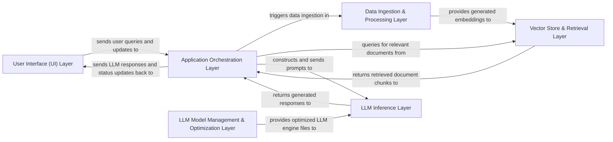

## Details

The `trt-llm-rag-linux` application implements a Retrieval-Augmented Generation (RAG) pattern, centered around an `Application Orchestration Layer` that manages the entire workflow. User interactions are handled by the `User Interface (UI) Layer`, which sends requests to the orchestrator. The orchestrator then interacts with the `Data Ingestion & Processing Layer` to prepare data and the `Vector Store & Retrieval Layer` to retrieve relevant context. For LLM operations, it leverages the `LLM Model Management & Optimization Layer` to prepare optimized models for the `LLM Inference Layer`, which performs the actual text generation. This layered approach ensures modularity, performance optimization, and clear separation of concerns for data handling, model management, and inference.

### User Interface (UI) Layer [[Expand]](./User_Interface_UI_Layer.md)
Provides the interactive graphical interface for users, handling input, displaying chat history, and managing model/dataset selections.

**Related Classes/Methods**:

- <a href="https://github.com/KingXHJ/trt-llm-rag-linux/blob/master/ui/user_interface.py" target="_blank" rel="noopener noreferrer">`user_interface`</a>

### Application Orchestration Layer [[Expand]](./Application_Orchestration_Layer.md)
The central control unit, coordinating data flow, managing application state, processing user requests, and orchestrating the end-to-end RAG pipeline.

**Related Classes/Methods**:

- <a href="https://github.com/KingXHJ/trt-llm-rag-linux/blob/master/ui/user_interface.py#L279-L288" target="_blank" rel="noopener noreferrer">`app`:279-288</a>

### Data Ingestion & Processing Layer [[Expand]](./Data_Ingestion_Processing_Layer.md)
Responsible for acquiring raw data from various sources, parsing it, and preparing it for embedding into the vector store.

**Related Classes/Methods**:

- <a href="https://github.com/KingXHJ/trt-llm-rag-linux/blob/master/dataset/" target="_blank" rel="noopener noreferrer">`dataset`</a>
- <a href="https://github.com/KingXHJ/trt-llm-rag-linux/blob/master/faiss_vector_storage.py" target="_blank" rel="noopener noreferrer">`faiss_vector_storage`</a>

### Vector Store & Retrieval Layer
Manages the storage of document embeddings (using FAISS) and efficiently retrieves relevant document chunks based on user queries.

**Related Classes/Methods**:

- <a href="https://github.com/KingXHJ/trt-llm-rag-linux/blob/master/faiss_vector_storage.py" target="_blank" rel="noopener noreferrer">`faiss_vector_storage`</a>

### LLM Model Management & Optimization Layer [[Expand]](./LLM_Model_Management_Optimization_Layer.md)
Dedicated to the lifecycle management of LLMs, focusing on their optimization for NVIDIA TensorRT-LLM, including conversion, building, and serialization of LLM engines.

**Related Classes/Methods**:

- <a href="https://github.com/KingXHJ/trt-llm-rag-linux/blob/master/build.py#L802-L891" target="_blank" rel="noopener noreferrer">`build`:802-891</a>
- <a href="https://github.com/KingXHJ/trt-llm-rag-linux/blob/master/weight.py#L159-L166" target="_blank" rel="noopener noreferrer">`weight`:159-166</a>

### LLM Inference Layer [[Expand]](./LLM_Inference_Layer.md)
Provides the core functionality for interacting with the optimized LLM, responsible for prompt preparation, executing LLM inference, and streaming generated responses.

**Related Classes/Methods**:

- <a href="https://github.com/KingXHJ/trt-llm-rag-linux/blob/master/trt_llama_api.py" target="_blank" rel="noopener noreferrer">`trt_llama_api`</a>

### [FAQ](https://github.com/CodeBoarding/GeneratedOnBoardings/tree/main?tab=readme-ov-file#faq)