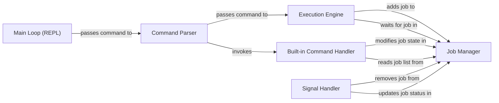

## Details

One paragraph explaining the functionality which is represented by this graph. What the main flow is and what is its purpose.

### Main Loop (REPL)
The heart of the shell. It repeatedly prints a prompt, reads a line of user input, and orchestrates the command evaluation process.

**Related Classes/Methods**:

- `eval` (1:1)

### Command Parser
Responsible for parsing the raw command line string into a structured format. It identifies the command, its arguments, and determines if it's a built-in command or an external program.

**Related Classes/Methods**:

- `parseline` (1:1)

### Execution Engine
Executes external commands. It handles forking a new process and using `execve` to replace the child process's image with the new program. It manages waiting for foreground jobs to complete.

**Related Classes/Methods**:

- `fork` (1:1)
- `execve` (1:1)

### Job Manager
Maintains a list of all running background and foreground jobs. It is responsible for adding, deleting, and retrieving jobs from this list. This component is critical for features like `jobs`, `bg`, and `fg`.

**Related Classes/Methods**:

- `addjob` (1:1)
- `deletejob` (1:1)
- `getjob` (1:1)

### Built-in Command Handler
Implements the shell's internal commands, such as `quit`, `jobs`, `bg`, and `fg`. It directly manipulates the shell's state, such as the job list, without creating new processes.

**Related Classes/Methods**:

- `quit` (1:1)
- `jobs` (1:1)
- `bg` (1:1)
- `fg` (1:1)

### Signal Handler
Manages asynchronous system signals. It is responsible for catching signals like `SIGINT` (Ctrl-C), `SIGTSTP` (Ctrl-Z), and `SIGCHLD` (when a child process terminates or stops) to manage job state correctly.

**Related Classes/Methods**:

- `SIGINT` (1:1)
- `SIGTSTP` (1:1)
- `SIGCHLD` (1:1)

### [FAQ](https://github.com/CodeBoarding/GeneratedOnBoardings/tree/main?tab=readme-ov-file#faq)