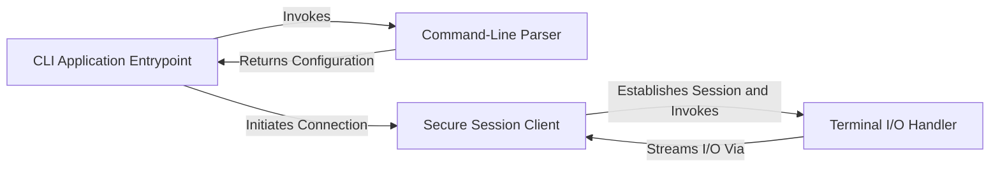

## Details

One paragraph explaining the functionality which is represented by this graph. What the main flow is and what is its purpose.

### CLI Application Entrypoint
Initializes the application, orchestrates the overall execution flow, and serves as the primary entry point for the `tsh` command. It contains the main loop that drives the application's lifecycle.

**Related Classes/Methods**:

- `tsh.c`

### Command-Line Parser
Interprets and validates user-provided arguments, flags, and sub-commands from `argv`. It translates these inputs into an internal configuration struct used to control the application's behavior.

**Related Classes/Methods**:

- `tsh.c`

### Secure Session Client
Manages the client-side session lifecycle. This includes establishing a network connection to the `tshd` daemon, handling the encryption handshake, and managing the secure communication channel.

**Related Classes/Methods**:

- `tsh.c`
- `pel.c`
- `aes.c`

### Terminal I/O Handler
Manages the local pseudo-terminal (PTY). It is responsible for capturing user input from stdin, forwarding it through the secure session, and writing remote output from the session to stdout.

**Related Classes/Methods**:

- `tsh.c`

### [FAQ](https://github.com/CodeBoarding/GeneratedOnBoardings/tree/main?tab=readme-ov-file#faq)