```mermaid
graph LR
    Listener_Service["Listener Service"]
    Authentication_Service["Authentication Service"]
    Authorization_Service["Authorization Service"]
    Session_Context_Manager["Session Context Manager"]
    Command_Executor["Command Executor"]
    Reverse_Tunnel_Service["Reverse Tunnel Service"]
    Audit_Log_Service["Audit Log Service"]
    Listener_Service -- "Forwards Connection" --> Authentication_Service
    Authentication_Service -- "Asks to check permissions" --> Authorization_Service
    Authorization_Service -- "Allows creation of session" --> Session_Context_Manager
    Session_Context_Manager -- "Provisions with security context" --> Command_Executor
    Session_Context_Manager -- "Uses to bridge connection" --> Reverse_Tunnel_Service
    Command_Executor -- "Sends records of executed commands" --> Audit_Log_Service
    Authentication_Service -- "Logs login attempts" --> Audit_Log_Service
```

## Details

One paragraph explaining the functionality which is represented by this graph. What the main flow is and what is its purpose.

### Listener Service
The entry point for all incoming network traffic. This component binds to specific ports (e.g., for SSH, HTTPS, reverse tunnels) and accepts client connections. It is responsible for handling the initial TLS handshake and forwarding the connection to the appropriate handler based on the requested protocol or role.

**Related Classes/Methods**:

- `tshd.c`
- `lib/srv/server.go`
- `lib/srv/listeners.go`

### Authentication Service
Handles all aspects of user and node authentication. It verifies client credentials (e.g., passwords, MFA, certificates) against a configured identity provider or the local user database. Upon successful authentication, it generates a short-lived session certificate containing the user's identity and roles.

**Related Classes/Methods**:

- `lib/auth/authservice.go`
- `lib/auth/server.go`

### Authorization Service
Enforces Role-Based Access Control (RBAC) policies. After a user is authenticated, this service checks the user's roles and the requested resource (e.g., a specific server or command) to determine if the action is permitted. It is consulted before any session is created or command is executed.

**Related Classes/Methods**:

- `lib/services/access.go`
- `lib/services/role.go`

### Session Context Manager
Creates, tracks, and terminates user sessions. Once a user is authenticated and authorized, this component establishes a session context, which includes the user's identity, permissions, and connection details. It manages the entire lifecycle of the session, from interactive PTY creation to final teardown.

**Related Classes/Methods**:

- `lib/srv/session.go`
- `lib/srv/context.go`

### Command Executor
Responsible for executing commands or creating interactive shells within the security context of a session. It captures standard input, output, and error streams, forwarding them back to the client. This component ensures that execution happens under the correct user identity and is subject to session constraints.

**Related Classes/Methods**:

- `lib/srv/exec.go`
- `lib/teleterm/pty.go`

### Reverse Tunnel Service
A critical component for nodes located behind NAT or firewalls. The Reverse Tunnel Service on the proxy allows nodes to establish persistent, outbound connections back to the proxy. Client connections are then tunneled through the proxy to the appropriate node, enabling access without direct inbound connectivity to the nodes.

**Related Classes/Methods**:

- `lib/reversetunnel/server.go`
- `lib/reversetunnel/agent.go`

### Audit Log Service
Records all security-sensitive events, including login attempts, session starts/ends, and executed commands. It formats these events into structured audit logs and forwards them to a secure backend (e.g., file, cloud storage). This provides a non-repudiable record of all activity.

**Related Classes/Methods**:

- `lib/auth/audit.go`
- `lib/events/emitter.go`

### [FAQ](https://github.com/CodeBoarding/GeneratedOnBoardings/tree/main?tab=readme-ov-file#faq)