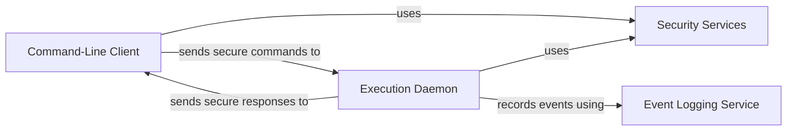

## Details

One paragraph explaining the functionality which is represented by this graph. What the main flow is and what is its purpose.

### Command-Line Client [[Expand]](./Command_Line_Client.md)
The primary user interface for interacting with the system. It is responsible for capturing user commands, packaging them for the server, and displaying the results.

**Related Classes/Methods**:

- `tsh.c`

### Execution Daemon [[Expand]](./Execution_Daemon.md)
The background server process that listens for client connections. It handles client authentication, receives commands, executes them securely, and returns the output.

**Related Classes/Methods**:

- `tshd.c`

### Security Services
A foundational component providing all cryptographic operations. It is used by the Daemon and Client to secure communications, handling data encryption/decryption and integrity checks.

**Related Classes/Methods**:

- `aes.c`
- `sha1.c`

### Event Logging Service [[Expand]](./Event_Logging_Service.md)
Manages the creation and formatting of event logs for auditing and debugging purposes. It provides a structured way to record system activities.

**Related Classes/Methods**:

- `pel.c`

### [FAQ](https://github.com/CodeBoarding/GeneratedOnBoardings/tree/main?tab=readme-ov-file#faq)