```mermaid
graph LR
    CLI_Configuration_Manager["CLI/Configuration Manager"]
    Controller_Analyzer["Controller Analyzer"]
    Type_Schema_Extractor["Type & Schema Extractor"]
    Code_Generator["Code Generator"]
    Runtime_Integrator["Runtime Integrator"]
    Validation_Middleware_Generator["Validation Middleware Generator"]
    Template_Engine["Template Engine"]
    Unclassified["Unclassified"]
    CLI_Configuration_Manager -- "configures & triggers" --> Controller_Analyzer
    CLI_Configuration_Manager -- "configures & triggers" --> Code_Generator
    Controller_Analyzer -- "provides API metadata to" --> Code_Generator
    Controller_Analyzer -- "provides type information to" --> Type_Schema_Extractor
    Type_Schema_Extractor -- "provides schema definitions to" --> Code_Generator
    Type_Schema_Extractor -- "provides schema definitions to" --> Validation_Middleware_Generator
    Code_Generator -- "generates intermediate code for" --> Runtime_Integrator
    Code_Generator -- "generates validation logic for" --> Validation_Middleware_Generator
    Code_Generator -- "uses" --> Template_Engine
    Runtime_Integrator -- "uses" --> Template_Engine
    Validation_Middleware_Generator -- "provides middleware to" --> Runtime_Integrator
    Validation_Middleware_Generator -- "uses" --> Template_Engine
```

## Details

The project implements a robust code generation pipeline, transforming TypeScript controller definitions into framework-specific API routes and OpenAPI specifications. The process begins with the CLI/Configuration Manager, which orchestrates the entire workflow by parsing command-line arguments and loading project configurations. The Controller Analyzer then meticulously extracts metadata from user-defined controllers, identifying routes, methods, and parameters. This metadata is fed into the Type & Schema Extractor, which translates TypeScript types into standardized data schemas crucial for validation and documentation. Subsequently, the Code Generator leverages this information to produce framework-agnostic route definitions and initial validation logic. The Validation Middleware Generator then creates runtime validation functions based on the extracted schemas. Finally, the Runtime Integrator adapts the generated code to specific web frameworks, registering routes and middleware, often utilizing the Template Engine for rendering the final output files. This modular design ensures clear separation of concerns, facilitating maintainability and extensibility across different web frameworks.

### CLI/Configuration Manager
The central orchestrator, handling command-line input, configuration loading, and initiating the code generation pipeline.

**Related Classes/Methods**:

- <a href="https://github.com/lukeautry/tsoa/blob/masterpackages/cli/src/cli.ts#L269-L292" target="_blank" rel="noopener noreferrer">`runCLI`:269-292</a>
- <a href="https://github.com/lukeautry/tsoa/blob/masterpackages/cli/src/cli.ts#L54-L85" target="_blank" rel="noopener noreferrer">`getConfig`:54-85</a>

### Controller Analyzer
Parses TypeScript controller files to extract API endpoint metadata, including routes, methods, parameters, and decorators.

**Related Classes/Methods**:

- <a href="https://github.com/lukeautry/tsoa/blob/masterpackages/cli/src/metadataGeneration/controllerGenerator.ts#L10-L147" target="_blank" rel="noopener noreferrer">`ControllerGenerator`:10-147</a>

### Type & Schema Extractor
Infers and translates TypeScript types into standardized data schemas (e.g., OpenAPI/Swagger definitions) for validation and documentation.

**Related Classes/Methods**:

- <a href="https://github.com/lukeautry/tsoa/blob/masterpackages/cli/src/metadataGeneration/typeResolver.ts#L20-L100" target="_blank" rel="noopener noreferrer">`TypeResolver`:20-100</a>

### Code Generator
Generates framework-agnostic route definitions, handler stubs, and initial validation logic based on analyzed metadata and schemas.

**Related Classes/Methods**:

- <a href="https://github.com/lukeautry/tsoa/blob/mastertests/esm/unit/templating/routeGenerator.spec.ts#L11-L29" target="_blank" rel="noopener noreferrer">`generateRoutes`:11-29</a>

### Runtime Integrator
Adapts the generated code to specific web frameworks (e.g., Express, Koa), creating framework-specific boilerplate and registering routes and middleware.

**Related Classes/Methods**:

- <a href="https://github.com/lukeautry/tsoa/blob/masterpackages/runtime/src/routeGeneration/templates/express/expressTemplateService.ts#L1-L100" target="_blank" rel="noopener noreferrer">`ExpressTemplateService`:1-100</a>
- <a href="https://github.com/lukeautry/tsoa/blob/masterpackages/runtime/src/routeGeneration/templates/koa/koaTemplateService.ts#L1-L100" target="_blank" rel="noopener noreferrer">`KoaTemplateService`:1-100</a>
- <a href="https://github.com/lukeautry/tsoa/blob/masterpackages/runtime/src/routeGeneration/templates/hapi/hapiTemplateService.ts#L1-L100" target="_blank" rel="noopener noreferrer">`HapiTemplateService`:1-100</a>

### Validation Middleware Generator
Creates middleware functions responsible for runtime validation of incoming request data against the generated schemas.

**Related Classes/Methods**:

- <a href="https://github.com/lukeautry/tsoa/blob/masterpackages/runtime/src/routeGeneration/tsoa-route.ts#L100-L200" target="_blank" rel="noopener noreferrer">`TsoaRoute.ValidateParam`:100-200</a>

### Template Engine
A shared utility for rendering final output files using predefined templates, utilized by various generation components.

**Related Classes/Methods**:

- <a href="https://github.com/lukeautry/tsoa/blob/masterpackages/runtime/src/routeGeneration/templates/templateService.ts#L6-L31" target="_blank" rel="noopener noreferrer">`TemplateService`:6-31</a>

### Unclassified
Component for all unclassified files and utility functions (Utility functions/External Libraries/Dependencies)

**Related Classes/Methods**: _None_

### [FAQ](https://github.com/CodeBoarding/GeneratedOnBoardings/tree/main?tab=readme-ov-file#faq)