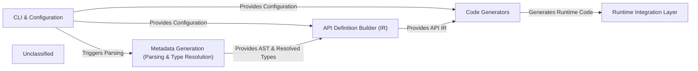

## Details

The `tsoa` project's architecture is designed around a clear, sequential data flow, starting from user input and configuration, progressing through metadata extraction and API definition, and culminating in framework-specific code generation and runtime integration. The core process involves the `CLI & Configuration` component initiating the build, which then feeds into the `Metadata Generation` component to parse source code and resolve types. The extracted metadata is then used by the `API Definition Builder (IR)` to create a unified, framework-agnostic representation of the API. Finally, the `Code Generators` consume this IR to produce the actual runtime code and OpenAPI specifications, which are then utilized by the `Runtime Integration Layer` to serve the API. This modular design ensures a clean separation of concerns, making the system extensible and maintainable.

### CLI & Configuration
The user's primary interface, handling command-line arguments, loading `tsoa.json` configuration, and orchestrating the code generation pipeline.

**Related Classes/Methods**:

- <a href="https://github.com/lukeautry/tsoa/blob/masterpackages/cli/src/index.ts" target="_blank" rel="noopener noreferrer">`packages/cli/src/index.ts`</a>
- <a href="https://github.com/lukeautry/tsoa/blob/masterpackages/cli/src/cli.ts" target="_blank" rel="noopener noreferrer">`packages/cli/src/cli.ts`</a>
- `tsoa.json`

### Metadata Generation (Parsing & Type Resolution)
Reads and parses TypeScript/JavaScript controller files into an AST, then resolves all relevant type definitions (interfaces, enums, classes) and extracts route metadata.

**Related Classes/Methods**:

- <a href="https://github.com/lukeautry/tsoa/blob/masterpackages/cli/src/metadataGeneration/controllerGenerator.ts" target="_blank" rel="noopener noreferrer">`packages/cli/src/metadataGeneration/controllerGenerator.ts`</a>
- <a href="https://github.com/lukeautry/tsoa/blob/masterpackages/cli/src/metadataGeneration/typeResolver.ts" target="_blank" rel="noopener noreferrer">`packages/cli/src/metadataGeneration/typeResolver.ts`</a>
- <a href="https://github.com/lukeautry/tsoa/blob/masterpackages/cli/src/metadataGeneration/methodGenerator.ts" target="_blank" rel="noopener noreferrer">`packages/cli/src/metadataGeneration/methodGenerator.ts`</a>
- <a href="https://github.com/lukeautry/tsoa/blob/masterpackages/cli/src/metadataGeneration/parameterGenerator.ts" target="_blank" rel="noopener noreferrer">`packages/cli/src/metadataGeneration/parameterGenerator.ts`</a>

### API Definition Builder (IR)
The core component for constructing the framework-agnostic Intermediate Representation (IR) of the API, consolidating and validating all extracted metadata.

**Related Classes/Methods**:

- <a href="https://github.com/lukeautry/tsoa/blob/masterpackages/cli/src/metadataGeneration/metadataGenerator.ts" target="_blank" rel="noopener noreferrer">`packages/cli/src/metadataGeneration/metadataGenerator.ts`</a>
- <a href="https://github.com/lukeautry/tsoa/blob/masterpackages/runtime/src/metadataGeneration/tsoa.ts" target="_blank" rel="noopener noreferrer">`packages/runtime/src/metadataGeneration/tsoa.ts`</a>

### Code Generators
A collection of specialized generators that consume the API Definition IR and produce framework-specific route files, controller adapters, and OpenAPI/Swagger specification documents.

**Related Classes/Methods**:

- <a href="https://github.com/lukeautry/tsoa/blob/masterpackages/cli/src/routeGeneration/defaultRouteGenerator.ts" target="_blank" rel="noopener noreferrer">`packages/cli/src/routeGeneration/defaultRouteGenerator.ts`</a>
- <a href="https://github.com/lukeautry/tsoa/blob/masterpackages/runtime/src/routeGeneration/templates/hapi/hapiTemplateService.ts" target="_blank" rel="noopener noreferrer">`packages/runtime/src/routeGeneration/templates/hapi/hapiTemplateService.ts`</a>
- <a href="https://github.com/lukeautry/tsoa/blob/masterpackages/cli/src/swagger/specGenerator3.ts" target="_blank" rel="noopener noreferrer">`packages/cli/src/swagger/specGenerator3.ts`</a>

### Runtime Integration Layer
Represents the *generated* code and runtime adapters that integrate the `tsoa`-generated API with the chosen web framework (e.g., Express, Hapi) for functional API serving.

**Related Classes/Methods**:

- <a href="https://github.com/lukeautry/tsoa/blob/masterpackages/runtime/src/routeGeneration/templates/express/expressTemplateService.ts" target="_blank" rel="noopener noreferrer">`packages/runtime/src/routeGeneration/templates/express/expressTemplateService.ts`</a>
- <a href="https://github.com/lukeautry/tsoa/blob/masterpackages/runtime/src/routeGeneration/templates/hapi/hapiTemplateService.ts" target="_blank" rel="noopener noreferrer">`packages/runtime/src/routeGeneration/templates/hapi/hapiTemplateService.ts`</a>

### Unclassified
Component for all unclassified files and utility functions (Utility functions/External Libraries/Dependencies)

**Related Classes/Methods**: _None_

### [FAQ](https://github.com/CodeBoarding/GeneratedOnBoardings/tree/main?tab=readme-ov-file#faq)